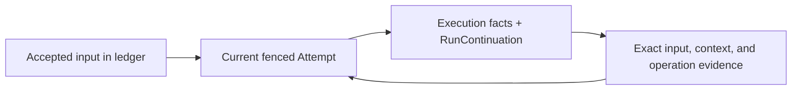

Persistent history retains conversations; durable execution also recovers accepted work after
process loss. The [runtime model](/concepts/runtime-model/) defines ownership and settlement. This page
covers recovery boundaries and adapter contracts; see [Threads](/guide/threads/) for history setup.

## Execution modes

| Class | Meaning                                                    |
| ----- | ---------------------------------------------------------- |
| `E`   | in-memory history; execution has no process-loss recovery  |
| `P`   | persistent history; execution has no process-loss recovery |
| `DN`  | durable admission and recovery on Node and SQLite          |
| `DC`  | the same contract on Cloudflare Durable Objects            |

Choose a deployment class and adapter with the recovery guarantees your application needs.
See the [Node.js](/platforms/node/) and [Cloudflare](/platforms/cloudflare/) guides for setup.

## Rebuild from the log

Replay rebuilds state from canonical records without executing tools. Projections and checkpoints
are disposable; retain canonical records when rebuilding them.

The execution protocol uses `effect-agent/thread@3` records in fresh layout-25 stores.
This format is unreleased: install matching runtime and storage packages, and retain predecessor
stores with their matching release. Opening or importing a predecessor format fails before mutation;
this release has no converter, predecessor decoder, or layout upgrade.

Same-format archives preserve canonical records, immutable admission facts, and accepted commands.
Pending admissions need not have reached the log. Import validates every reference and rebuilds
operational state in an empty Thread without importing execution ownership. Unresolved ordinary
mutating calls remain Unknown. See [backup and restore](/guide/operations/#adopting-these-contracts).

A selected Run recovers from its canonical continuation and exact Run evidence at one captured
tail. Later facts enter through a bounded selected-Run suffix. Unrelated later Thread history never
becomes recovery input. Missing or invalid evidence leaves the work owed with a typed failure;
there is no full-Thread replay fallback.

`ThreadProjection` version 3 derives open tool calls from committed model responses and scopes
calls and subagent invocations by Run and Tool Call ID. Decode projection state with its Schema
before replaying a suffix. Earlier versions, including empty views, must be discarded and rebuilt
from canonical records.

## Complete a submission

The storage owner publishes one canonical `SubmissionSettled` record after checking the current
claim, joined host, or queued abort authority in the same transaction. Delivery and parent
acknowledgements complete before ledger finalization releases the lane. Finalization derives the
outcome from that record and preserves its first finalization timestamp on every retry.
SQL adapters finalize plain-root submissions in the publication transaction; submissions with
delivery or parent obligations retain recoverable finalization after those obligations complete.
SQLite's opt-in WAL `synchronous: "NORMAL"` survives process crashes, but power loss or an OS crash can lose acknowledged commits and cause external effects to repeat during recovery.

A crash before publication resumes from existing execution facts: a committed `RunCompleted`
retains its output, while unresolved ordinary tools remain uncertain. A crash after publication
repeats notifications and finalization without choosing another outcome. There is no separate
settlement reservation or reserved-record recovery phase.

Completion-tool results commit before the runtime drains new input at the turn boundary.
If a crash occurs before `RunCompleted`, recovery reuses the recorded result without executing
the handler again. It may reevaluate the completion projection, so keep that function pure and
deterministic. `RunCompleted` fixes the output and disposition for subsequent recovery. A final
response with no application tool calls commits atomically with its `RunCompleted` record.

## Run continuations

`RunContinuation` records a semantic boundary: preparing context, awaiting a model, processing
declared operations, waiting, uncertain, or settling. It commits in the same fenced transaction
as the execution facts it references. Its latest-record index is disposable; the ledger alone
admits work and grants ownership.
Offline `verify` recomputes each continuation from its referenced facts, including accounting.

The continuation contains cumulative policy and model charges plus bounded, integrity-checked
references to the original input, original evaluated context, latest native response, and terminal
facts. Results, Durable Steps, approval decisions, and original operation contracts keep their own
canonical identities. Recovery reuses those facts; it neither replenishes allowances nor repeats
recorded results. An unresolved ordinary mutating call still requires reconciliation.

`RunContextRecorded` preserves evaluated instructions and this Run's input, plus a canonical
history range and the digest of its projected prior Prompt. It retains exact references only to
earlier facts still needed after compaction. It shares the start transaction without copying prior
Prompt payloads or a per-record history manifest. Compaction changes the model view independently.
A compatible current Binding supplies execution services, while saved instructions, user intent, and the Run's
own continuation remain unchanged by another Run's later traffic. New Runs evaluate current
instructions. Input-dependent Bindings must still decode the original admitted value. A current
input Schema refusal returns `BindingUnavailable`, releases the Attempt, and leaves the original
receipt pending until a usable Binding returns. Missing Bindings and incompatible pending
operation semantics also leave work owed.

Execution dispatch is bounded at 16,384 facts and 32 MiB, in pages of eight records.
Preparations before the first continuation and a post-continuation suffix each have a limit of
64 records and 2 MiB. The continuation record is limited to 8 KiB; incremental record JSON is
capped at 4 MiB per Turn, including continuations and the first Turn's initial context and retained
preparations. Individual persisted JSON payloads remain limited to 1 MiB; whole record wire has a
4 MiB limit to include its envelope. Indexes have separate storage costs.
Dispatch reserves bounded Tool outcomes and a full valid Step result before a new Step body
starts. Concurrent Steps share that capacity. Every dispatch retains room for a bounded failure
settlement and usage metadata; insufficient capacity refuses execution or fails the Run.
Abort, failure, and settlement consume their reserved room and can commit after ordinary capacity
is exhausted. Terminal evidence has a separate hard allowance of four facts and 8.25 MiB;
successful output still requires its dispatch capacity. Reservations are conservative and can
refuse work before the byte limit itself is reached. The original history range has no lifetime
record limit; at most 4,096 earlier exceptional facts can be retained outside that range.
Evaluated Run input uses the individual persisted JSON limit. Active Attempts retain a validated
prefix and read only new execution facts. Cold recovery rereads the original range and retained
facts, regenerates compaction boundaries, and refuses a Prompt digest mismatch.

Worker lineage and subtree funding remain immutable provenance. Each worker input records its own
execution owner: a Tool handoff charges its emitting Run, while host follow-ups and receiving
framework reports have no source Run charge. Later inputs never enlarge a settled launching Run.

Exact evidence reads and same-format archives retain additive fields and the original wire values.
Reading a typed view never changes the content pinned by an evidence digest.

New Runs read only history-relevant fields of the selected range and project them once. They
trust immutable history validated at write, archive, and import boundaries; they do not reverify
every earlier Run's original context. Late Tool results outside the selected declarations still
require their full original evidence. Import checks saved admission boundaries and retained
references without reprojecting each range; cold recovery and explicit `verify` recompute the
saved Prompt before trusting it.

Without compaction, history reads and the live Prompt remain linear in conversation length.
Configure context limits for the model and host. Later compaction never rewrites an older Run's
original context. Work discovery uses native owner indexes; explicit index reconstruction,
archive partitioning, and streamed transfer have separate working-set bounds.
Generic `ThreadStore.checkpoints` remain optional application projections and never govern execution.

## Track unfinished work

An unknown Submission without abort intent is parked: later input can run in the same Thread
while the original settlement obligation stays open.
Suspended, joining, and joined work retain their ordering barriers. At most one live owner can
claim a Thread; a wake hint does not acquire ownership or advance its fencing epoch.

A host can opt into `SubmissionScheduling.yieldTo` to handle the next same-Agent input in its
own Run after a completed Turn. The prior Attempt closes before the next one acquires ownership;
principals, captured inputs, receipts and reply identities remain separate. Keep independent inputs
out of `claimJoining`. The policy cannot bypass an admission gap, pending approval or child wait,
and does not interrupt in-flight model requests or Tool batches. Deferred Runs remain owed and
resume with their original authority and deadlines. Their model context contains history preceding
their start and their own Turns. Later results can close prior historical calls, but another Run's
continuation cannot replace the current input. Compaction covers its creator's context while
complete Thread history retains interleaved exchanges from other Runs.

The Thread work inventory combines accepted admissions with unresolved operations, approvals,
children, worker inputs and acknowledgements, reports, and deliveries. These owners outlive a Run when their own work
remains unfinished. A settled or stopped worker retains its source capacity until its original
effects are factually resolved. Authorized `CompletedWithResult` and `NeverHappened` resolutions
can record that truth after settlement; they preserve the original receipt and outcome.
The destination owns acknowledgement publication until factual effects are recorded; the source
retains a retry deadline and copies that acknowledgement to release its input capacity.

`runtime.discoverWork({ threadId, limit, cursor })` returns identities, owning state references,
and scheduling metadata. It reads no execution payloads and grants no ownership or authority.
An empty page with a cursor still has more work to enumerate. Cursors are live, Thread-bound
scans: new work behind the cursor appears in the next scan. `recoverWork({ threadId, work })`
resolves the selected canonical evidence and original admission before repairing it. A frozen
message preparation remains discoverable even when its delivery row was never inserted.

Missing, incompatible, or incomplete indexes return `WorkDiscoveryUnavailable`, never an empty
inventory. Call `rebuildWorkIndex({ threadId, restart: true })` explicitly to discard a damaged
derivative, then call without `restart` until `state` is `ready`. Each pass processes at most
eight canonical records and 32 MiB. Concurrent appends remain canonical; completion checks the
current tail under the same storage writer. Ordinary recovery never starts this scan implicitly.

`runRecovery()` selects at most 32 owners across at most 32 Threads, with at most eight inventory
pages per Thread. It returns Submission `reports`, content-free `workReports`, one `blocked`
fault per failed Thread, and a resumable `cursor`. Follow that cursor to finish the scan. Selected
evidence is released between owners. Blocked Threads cannot be claimed until recovery succeeds.
Pass `{ threadId }` to recover one Thread independently, preserving that selection when resuming.
Scoped continuations stay compact and bound to that Thread. Global continuations retain one
routing identity, so their size grows with the supported Thread identity.
The host owns durable fault visibility and retry scheduling outside the execution log. The
default cooperative recovery bound is 30 seconds per Thread (`recoveryTimeout`). Interruption
and global SQL/control-identity scan failures still fail the sweep. A recovery fault never settles accepted work,
proves an external effect failed, or authorizes replay.

## Exactly-once recording

Recovery records `UnknownToolOutcome` when an ordinary tool may have acted without a recorded
result. It cannot safely infer failure or replay the call. Durable Steps reuse recorded results;
their external execution can repeat and still needs idempotency or reconciliation.

Step identity includes the Run ID, Tool Call ID, and Step name. New Step record and batch IDs use
a versioned JSON tuple so separator characters cannot merge distinct Steps. Recovery derives
the same identity from each recorded payload without executing completed Step bodies again.

## Workflow recovery

The optional [`WorkflowAgentHost`](/guide/workflows/) drives this runtime through an
injected Effect `WorkflowEngine`. Replacing the engine Layer leaves the agent definitions and
durable driver unchanged. See the guide for host composition and platform setup.

Each native Workflow advances a submission through journal recovery and bounded Attempts.
Pending work, approvals, unknown outcomes, and native suspension remain unfinished until the
canonical log contains a Settlement. Infrastructure failures suspend the Workflow for repair.
Ordinary tools remain ordinary tools; the driver does not wrap them in replayable Activities.

Inside an application Workflow, `AgentWorkflow.execute` assigns each named step a stable
submission identity and awaits an upstream `DurableDeferred`. The dispatch intent retains its
completion token until repair delivers a reference to the canonical Settlement. Notification
and cleanup are separate recoverable commits. A resumed handler rechecks admission identity and
authorization and decodes the canonical result; the deferred does not store a second copy of
the Agent output. Parent interruption detaches the caller without cancelling accepted work.

Admission, dispatch intent storage, and native Workflow storage commit independently. A required
host-owned repair trigger discovers accepted work and retries retained dispatch intents after
lost hints or process loss. An intent remains until native success identifies the matching
canonical Settlement. No cross-database transaction encloses an agent execution.

Interrupting an observer or settlement waiter detaches it. Abort and resolution commands use the
durable runtime's authorization and intent protocol. Native Workflow interruption is not the
agent cancellation API. Each Attempt releases its ownership and resources before suspension.

## Retain resources while awaiting approval

`AgentRegistration.attemptLayer` owns services for one fenced Attempt. Its resources finalize
when the Attempt completes, suspends, fails, or is interrupted. A replacement Attempt builds
fresh services around any externally retained resource.

When an approval wait must retain a resource, provide `DurableApprovalSuspension` from that same
Layer. This optional `Effect<void, ApprovalSuspensionError>` captures the live services and finishes
the host's checkpoint and handoff before returning. Import both names from
`@yielded/agent/durable-agent-runtime`. Wrap typed failures in `ApprovalSuspensionError.make({ cause })`
using `Effect.catchCause` and `Cause.map` to preserve accompanying defects and interruptions.

The runtime calls it after recording the approval request, while claim renewal and abort observation
remain active. Failure preserves its cause and leaves accepted work owed; interruption runs normal
cleanup. If approval arrives during retention, the old services and claim finalize before a fresh
Attempt resumes the same Run's pending tool batch. Completed tools are not repeated, and unresolved
ordinary effects still require reconciliation.

## Admission and recovery

The runtime returns a Receipt after durable ledger admission, thread materialization, and
readiness. Reusing an admission key with the same input returns the same Receipt. Different input
conflicts. Admission sequence sets queue order.

Each producer write checks its ownership token and epoch. A stale attempt cannot append after a
replacement takes ownership. Recovery uses the same current binding selection as execution (unique stable Agent ID by
default, or explicit host selection from the canonical Submission). It validates a strongly
consistent canonical prefix before classifying the last committed boundary:

| Last committed boundary                           | Recovery                                                                     |
| ------------------------------------------------- | ---------------------------------------------------------------------------- |
| admission without readiness                       | finish materialization and readiness                                         |
| ready input with no attempted execution           | leave input application to the normal worker claim                           |
| input appended without its ledger marker          | repair the marker without applying input twice                               |
| `RunStarted`                                      | preserve the original deadline                                               |
| incomplete model response                         | retry inference when policy allows; provider charges may repeat              |
| committed ordinary mutating call without a result | reconcile or record `UnknownToolOutcome`                                     |
| initial pending or denied approval                | preserve the blocked batch; no handler started                               |
| canonical tool or Durable Step result             | reuse the recorded result                                                    |
| `RunCompleted`                                    | preserve stored output and disposition; validate `resultDigest` when present |
| canonical settlement without ledger finalization  | finalize from history                                                        |

Joined input follows the same rule. Claimed input without a canonical append returns to ready.
Appended input rejoins its host run and settles with it. Approval must be canonical before work
resumes. Unknown work releases execution permits while keeping its accepted obligation open.
Abort preserves evidence and cannot roll back external effects or replace a settlement that won.
See [Operations](/guide/operations/).

Application tool call IDs must be unique within a Run. A durable Run permits at most 4,096 distinct
application call IDs; reuse or a response exceeding that limit fails with `RunJournalError` before
that response commits or its tools dispatch.
The committed model response owns each call's normalized arguments and original execution class,
kind, and replay hash. There is no separate preparation record. Losing ownership immediately
after that response commits can therefore leave an ordinary mutating call unknown, even if its
handler had not started. Execution still validates arguments, resolves the whole batch's approvals,
checks host authorization, and rechecks the writer fence before granting handler permits.

A turn containing only ordinary readonly calls without approval can commit its response and
results together. If interrupted before that commit, recovery may ask the model again. Using a
Durable Step, reserving durable policy capacity, or accepting an update first commits the saved
response. Idempotent calls retain the earlier declaration so retries keep the original call.

A pending or denied approval recorded before the original dispatch proves that the whole batch
never started. An initially blocked approval flow retains this proof across resumes until dispatch;
an approval after possible execution cannot restore it. Parameter rejection proves nonexecution
of its individual call. Approved calls without results remain uncertain.

Recovery uses the original recorded arguments and operation contract. `CompletedWithResult`
injects a confirmed result and must agree with any already committed tool result; `NeverStarted`
proves nonexecution. `SafeToRetry` permits another
attempt under compatible original semantics, but cannot authorize changed code or erase uncertainty.
Readonly and idempotent calls retain their declared replay behavior. Unsupported effects stay unknown.

Later model requests preserve earlier user intent, assistant text, and settled sibling results.
Missing results remain explicitly unknown unless canonical evidence proves nonexecution. This
explanatory history creates no tool settlement and cannot resolve an effect. Compaction retains
unresolved declarations. Recovered discovery selections keep only currently defined tools; newly
added tools do not enter the saved selection. A committed `RunCompleted` output and disposition
remain authoritative across later codec or completion-projector changes.

## Attached subagents

A [durable attached child](/guide/subagents/durable-attached/) owns a separate thread and attempt.
The waiting parent releases its worker permit; recovery rejoins the existing child.

Completed sibling tools retain their results while a child is suspended. Their failures use the
Tool's declared encoded failure value, as ordinary settlements do. Decode them with that failure
Schema rather than expecting an observer diagnostic such as `{ errorTag, message }`.

Recovery preserves child identity and checks the registered tool's delegation classification.
Missing or conflicting classification fails closed. If admission cannot confirm whether a child
was accepted, the parent keeps waiting; it never starts a replacement child.

Joining verifies the child's settlement, lineage, and definition digests, decodes and bounds the
projected result, and commits it atomically with the parent tool result. Child transcripts remain
private unless the projection exposes them.

Budget release happens once. A crash may hold a reservation until repair, but cannot make it
available twice. Run accounting survives replacement attempts, including pending turns,
programmatic calls, failure streaks, usage, cost, and the original deadline. A reservation made
before a crash may consume allowance even when the corresponding work never executes.

Parent abort records intent for each child and joins the child's terminal outcome before settling
the parent. Unknown child effects remain operator obligations. After the parent deadline, recovery
may finish child abort, join, and accounting work. It cannot start a child, call application
projectors, run tools, or continue the model.
