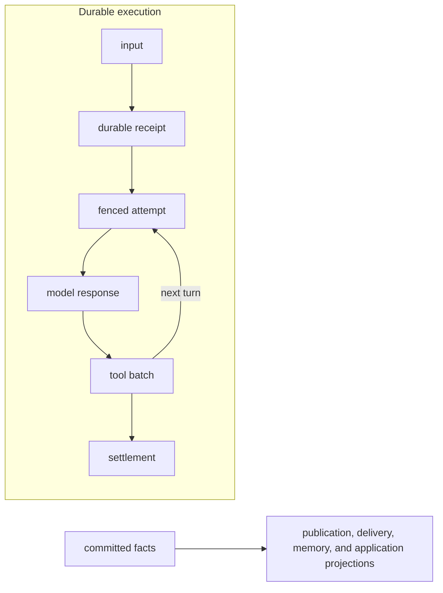

An Agent Definition describes the work. The interpreter advances a Run through model responses
and tool batches. A durable host owns admission, Attempts, and recovery; the application owns
authority, public replies, and application read models. These are the runtime's design rules.

## Turns and responsiveness

- Use one scoped Effect interpreter for running, streaming, and durable execution. Public streams
  observe that execution through a bounded producer; headless runs do not transport public events.
  Finish the model response before starting application tools. Validate and authorize executable
  calls, honor approvals,
  and commit their bounded results in declaration order after their streams close, before draining
  new input or starting the next turn. Tool concurrency and run budgets are finite; all execution
  resources belong to a Scope.
- Ordinary readonly turns without approval may commit response and results together. Persist the
  response before a Durable Step, durable policy reservation, or accepted update. Idempotent and
  mutating calls keep their declaration before dispatch, preserving the original recovery decision.
- Admit new input ahead of eventual work. In Cloudflare, new native work preempts maintenance;
  publish the lifecycle start promptly after pickup. Reply publication, projection backfills, and memory
  have independent recovery obligations and must not become prerequisites for a model call.
  Required custom `ThreadPublication` is an exception: it can still defer native execution
  while pending or parked. Local projection updates can also precede tool reads. Use independent
  maintenance lanes for eventual application delivery.
- Apply steering at complete turn boundaries and follow-ups when the Run would otherwise stop.
  Eligible durable input joins under the host's authority policy, keeps its own Receipt, and
  settles with the Run that covers it. Independent principals must retain independent authority.
- Opt into `restartOnJoinedInput` to replace a disposable model call with joined input before
  its response commits or application tools start. At most two replacements survive across
  recovery. Clear cancelled drafts on `ModelRestarted`. Later joins use the normal boundaries;
  tools already executing are never interrupted merely to steer. Exposing a hosted tool without
  an explicit read-only annotation disables this restart because it may already have acted.
- Prefer provider-hosted tools in the main model request, such as `WebSearch.native`. Read-only
  hosted search can be interrupted and repeated. Use the separate search-model capability only
  when the calling provider cannot host the required tool; account for its separate usage.
- Keep request prefixes stable: tool declarations, then static instructions, then growing history
  and changing context. Preserve their bytes and order when their meaning has not changed.
  Provider instruction placement and dynamic tool selection affect caching; a hit is never a
  runtime guarantee. See [prompt caching](/guide/run-agents/#prompt-caching).

## Ownership and recovery

- Every acknowledged Submission remains owed until canonical terminal Settlement. Preserve exact
  Submission, Receipt, delivery, idempotency, and settlement identities through retries, eviction,
  and restart. Recovery repeats acknowledgements of the same work; it never admits replacement
  input to resolve an uncertain receipt.
- Deliveries distinguish retention, acceptance, and processing. A target notifies the source from
  canonical terminal settlement. Approval, input, and capacity waits park the exact accepted
  Receipt. Generic host deliveries must supply terminal acknowledgement or explicit recovery;
  a wake hint is never proof of completion. See [messaging](/guide/messaging/).
- Canonical `SubmissionSettled` is the single terminal intent. Its publisher checks live authority
  and appends the record in one storage transaction. Delivery and parent acknowledgements follow
  that publication; ledger finalization records a stable receipt timestamp and releases the
  lane. An adapter may finalize inside publication when no recoverable delivery remains.
  Recovery completes outstanding obligations from the same canonical record.
- The append-only journal owns execution facts; the ledger owns what is still owed and who may
  advance it. Canonical continuations preserve semantic progress and exact original context;
  projections, work inventories, latest-record indexes, and application checkpoints are disposable. Current bindings select queued and
  resumed work; each committed model response owns its normalized tool arguments and original
  operation contracts. A declared mutating call without a result may have executed, including when
  ownership is lost before its handler starts. Initial blocked approvals and parameter rejections
  prove nonexecution; unresolved ordinary tools are never automatically replayed after ownership loss. Durable Steps still require external idempotency
  or reconciliation: exactly-once recording does not promise exactly-once execution.
- Keep application reads in application-owned views. Durable Object SQLite retains execution
  and recovery state, not a second application query model. Measure a statement budget for a
  representative turn when changing storage; fewer queries must not weaken fencing or receipts.
- Keep synchronous work bounded so single-threaded Objects can receive input. Reuse codecs and
  committed views. Unfinished Runs read their exact canonical continuation and bounded selected
  evidence, independently of unrelated Thread history. Missing or corrupt progress fails typed
  and leaves accepted work owed; it cannot silently fall back to a full-Thread scan. First context
  assembly, explicit index reconstruction, and exports have separate history costs and bounds.
  Native work pages include terminal side obligations and never grant execution authority.
  Missing inventories fail explicitly; rebuild them in separate resumable maintenance passes.
  Canonical row caches share an isolate-wide bound; never allocate that budget per Object.

## Cloudflare wake rules

- Wake for new input, committed source facts, settlement notifications, and explicit deadlines.
  Idle Objects take no alarms. Execution lease renewal belongs only to a live Attempt, including
  its resource handoff; a parked approval or accepted delivery is not a running execution.
- Self-rearming work has a finite no-progress budget, a retry floor, and backoff. Unchanged
  pending work eventually parks, reports once without content, and retries at most hourly.
  Genuine committed progress resumes it immediately. Claims, clock changes, retries, and repeated
  wake hints cannot replenish the budget. Draining a lane ends that pending obligation.
- These alarm rules apply to the Cloudflare host. Node's lost-hint recovery scans and the generic
  settlement waiter still poll; do not describe them as notification-only. See
  [Cloudflare maintenance](/platforms/cloudflare/#share-an-application-object) for host integration.

## Observation

Observe CPU-heavy hydration and decoding within the enclosing operation spans, following the
[tracing policy](/guide/run-agents/#trace-agent-and-model-calls). Per-record and per-decoded-row
helpers remain untraced.
Object clocks may not advance during synchronous work, so elapsed clock samples alone cannot
establish a CPU budget. Preserve original failure causes where the error contract carries them;
some storage boundaries retain only diagnostic classifications. Keep scheduling reports content-free.
The interpreter supplies validated response and closed tool-result facts directly to the canonical
journal. Events, history callbacks, and disposable drafts help observers follow execution; they do
not reconstruct durable commits. Only canonical records establish recovery facts.
Execution captures its services when it starts; changing a stream consumer's Context between pulls
does not change the running model, tools, or hooks.

See [Run & stream](/guide/run-agents/), [budgets](/concepts/budgets/), and
[durability](/concepts/durability/) for options and recovery boundaries.
