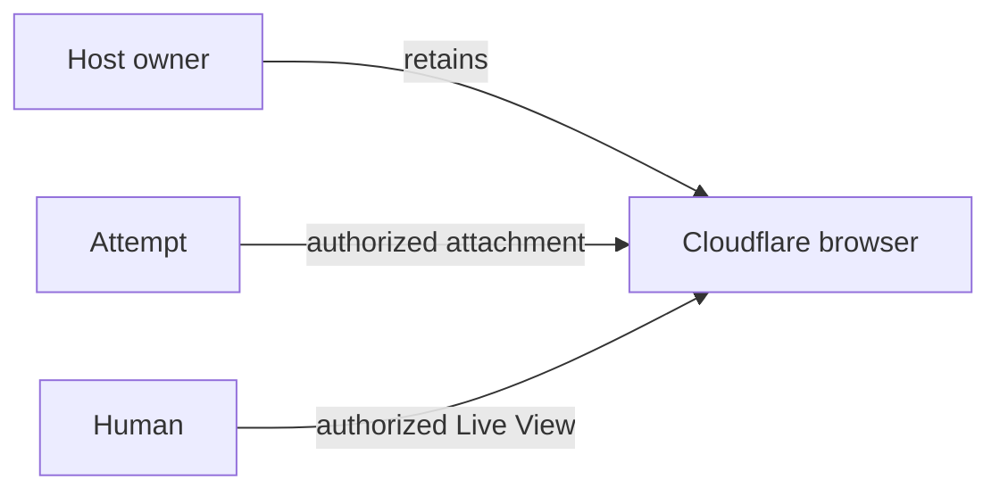

<a id="browser-tools"></a>

Give an agent rendered page text, extract records, collect a site's Markdown, or let an operator
watch an interactive browser pass. Your application supplies Cloudflare bindings or credentials,
authorizes actions, and chooses the data its Tools return.

Start with a stateless capture for one page. Choose a crawl only when the task needs a bounded set
of same-host pages. Use an interactive pass only when navigation or page actions are essential.

| Need                                                                  | Choose                                | Where it runs                     | What the application provides                                      |
| --------------------------------------------------------------------- | ------------------------------------- | --------------------------------- | ------------------------------------------------------------------ |
| Render one URL as Markdown, scrape selectors, or take a PNG           | **Quick Actions**                     | A Cloudflare Worker               | A Browser Run binding                                              |
| Render Markdown, links, selector groups, or structured data from Node | **REST capture**                      | Any host with Effect `HttpClient` | Cloudflare account ID and API token                                |
| Crawl a site into bounded rendered Markdown records                   | **REST crawl**                        | Any host with Effect `HttpClient` | Account ID, API token, and a Scope                                 |
| Navigate, read, click, fill, scroll, or capture one active page       | **Interactive Browser**               | A Cloudflare Worker               | Browser binding, lifecycle token, and Puppeteer                    |
| Let an operator inspect or take over an active pass                   | **Interactive Browser host controls** | A trusted Cloudflare Worker host  | A Browser Run API token, kept private                              |
| Keep one page through approval, credentials, and human takeover       | **Browser Sessions**                  | A trusted Cloudflare Worker host  | Durable owner, current authority, browser binding, lifecycle token |
| Inspect and act through agent tools                                   | **Native browser tools**              | An existing Browser Session       | Model layers and current host authority                            |

Browser output is untrusted input. Validate model-selected URLs against your host policy. Resolve
vault credentials in the host; keep provider handles, Live View URLs, and handoff identities out of
model Tools and agent journals.

In your application, install the browser adapters:

```sh
bun add @yielded/agent-platform-cloudflare@beta effect
```

Keep framework packages at the [same release](/guide/getting-started/#installation-and-compatibility).
The REST examples need no Puppeteer dependency.

## Choose an adapter

### Quick Actions in a Worker

Quick Actions are best for a single render operation: Markdown, selector scrape, screenshot, and
the other Browser Run one-shot actions. A Worker binding authenticates the request without putting
an API token in the Worker. Configure the binding and use a compatibility date of `2026-03-24` or
newer. For local `wrangler dev`, Browser Run Quick Actions need remote mode.

```jsonc
{
  "compatibility_date": "2026-03-24",
  "browser": {
    "binding": "BROWSER",
    "remote": true,
  },
}
```

The `remote` setting is for local development. Deployments use the binding normally. Cloudflare
documents the binding, compatibility date, and remote-mode requirement in its
[Quick Actions guide](https://developers.cloudflare.com/browser-run/quick-actions/).

For a WebCapture Tool, use `CloudflareBrowser.layer(ReadPage, { browser: env.BROWSER })` as shown
below. For direct port access, provide
`BrowserQuickActionBrowserBinding.layer({ browser: env.BROWSER })` to the adapter. Use
`browserQuickActionCaptureLayer` for `PageCapture` and
`browserQuickActionScreenshotLayer` for `PageScreenshot`. The capture adapter supports rendered
Markdown, links, selector scrape, and structured extraction. Structured extraction may invoke
Workers AI: authorize that separately and account for its provider cost before using it.

Quick Actions have no local implementation. Surface rate or quota failures and keep calls bounded.

### REST capture and crawl

The REST adapters run in Node or a Worker and need an account ID, a redacted API token with
**Browser Rendering - Edit** permission, and `FetchHttpClient.layer`. They are useful when the
browser work belongs in a Node service, job, or test harness rather than inside a Worker binding.

`browserRestCaptureLayer` implements `PageCapture`. It can capture rendered Markdown, links,
selector scrape, and extraction requests. `browserRestCrawlLayer` implements
`PageCrawl`: it starts the provider job, polls bounded pages, and cancels a known-running job when
the consuming Scope exits. The REST crawl adapter deliberately exposes only a credential-free HTTPS
starting URL and returns Markdown records from that start host.

Cloudflare's [Markdown endpoint](https://developers.cloudflare.com/browser-run/quick-actions/markdown-endpoint/)
accepts either a URL or HTML. `PageCaptureRequest` likewise accepts a `PageUrlTarget` or
`PageHtmlTarget`; authorize a URL target in your host before requesting it. Cloudflare's
[`/crawl` documentation](https://developers.cloudflare.com/browser-run/quick-actions/crawl-endpoint/)
explains how declared purposes interact with a target site's Content Signals policy. The framework
requires an explicit `purposes` array. Declare `ai-input` when feeding crawled content to a model;
use `search` when building a search index.

### Interactive Browser

An interactive pass owns one browser, context, and page for one Scope. It is for workflows that
need to inspect an active page, follow a known flow, or perform host-approved UI actions. It is not
a general browsing session and cannot become an agent Tool.

The adapter includes its Puppeteer client. Provide
`CloudflareInteractiveBrowser.layer({ browser: env.BROWSER, accountId, apiToken })` with
`FetchHttpClient.layer` for browser actions. `CloudflareInteractiveBrowser.hostLayer` opts into
trusted host controls for Live View and handoff. Both variants assemble the browser binding and
confirmed-session cleanup; the API token must be redacted. The lower-level binding, lifecycle,
and adapter Layers remain available for custom composition.

The policy is immutable when the pass opens:

- `ExactHosts` permits only a fixed set of HTTPS host authorities for page requests. It is a URL
  allowlist, not a public-network boundary.
- `PublicWeb` requires the adapter to enforce public-address containment at connection time. An
  adapter that cannot enforce it fails before opening a browser. Cloudflare rejects this policy
  with `InteractiveBrowserUnsupportedError` before acquisition.
- `Unrestricted` explicitly opts out of host and private-network containment while retaining the
  action, elapsed-time, and result-byte limits.

Choose `ExactHosts` for a known site. Let a trusted host, never model output, choose
`Unrestricted`. One policy also fixes maximum actions, elapsed time, and bytes returned by each
operation.

## Give an agent native browser tools

`BrowserUse` separates the agent's tools from the browser's lifetime and authority. The
Cloudflare native adapter implements observation and input over an existing scoped
`BrowserSession.run` attachment. The host chooses the engine, owns credentials and cleanup,
and authorizes every operation; it does not implement DOM interaction or recovery.
The authorization callback receives current page/frame URLs, the observed input target,
and the destination URL for tab selection. Its Effect dependencies are captured when
the controller is built. The initial attachment read has no cached URL; authorize that
attachment in the host before exposing its tools.

```ts twoslash
import { BrowserUse } from "@yielded/agent";
import type { BrowserSession } from "@yielded/agent-platform-cloudflare/browser-session";
import * as NativeBrowser from "@yielded/agent-platform-cloudflare/browser-use";
import { Effect, Layer } from "effect";

declare const session: BrowserSession;
declare const authorize: NativeBrowser.Options["authorize"];

const browser = BrowserUse.make({ mode: "batched" });
const attach = Effect.gen(function* () {
  const controller = yield* NativeBrowser.make(session, {
    authorize,
    maxActions: 100,
    maxReturnedBytes: 128 * 1024,
  });
  // Build and consume these handlers within this attachment's Scope.
  return Layer.merge(browser.layer(), BrowserUse.browserLayer).pipe(
    Layer.provide(controller.layer),
  );
});
```

Include both `browser.toolkit` and `BrowserUse.browserTools` in the Agent's Toolkit.
The model supplies observed refs, as in `{ action: { kind: "click", ref: "save" } }`;
`{ mode: "batched" }` accepts `actions` arrays of up to eight. They provide observe/act, scoped inspect, navigation, native key presses, selection,
scrolling, screenshots, condition waits, observed tab/popup selection, and native dialog
responses. Inspection accepts CSS and bounded attributes; it never accepts page JavaScript.
Screenshots return PNG bytes for the host; composing visual model input remains host-owned.
Condition waits accept a case-sensitive text qualifier for every state, normalizing whitespace
as observations do. For example,
`{ selector: "body", state: "hidden", text: "Loading", timeoutMillis: 5000 }`
waits until the visible body no longer contains "Loading".
Set `settleAfterAction: true` on the native controller for bounded DOM settling, or
`"input"` for brief frame and autocomplete settling. `maxWaitMillis: 5000` caps condition
waits at five seconds and returns the current observation on timeout; inspect that observation
to determine whether the condition was met.
The [standalone journey host](https://github.com/danieljvdm/effect-agent/tree/main/examples/browser-speed)
shows the complete composition.

By default, an observation contains live values, options, disabled/checked state, frame and tab
references, and visible controls outside the viewport, including open shadow roots.
It marks truncation explicitly. Inspection expires previous control references; narrow
by selector or an observed frame when necessary. Hidden content is excluded from bounded
inspection and text waits. Selector inspection starts at matching roots so unrelated visible content cannot consume
its scan budget. Open-shadow discovery remains bounded and marks truncation explicitly.
Default inspection reads the main frame;
other frames are listed with `inspected: false` for explicit lookup. After input, observation
follows the target frame, falling back to the main frame if it detached. Use `optionFilter`
to find select options by label or value; current selections remain visible.

`viewportOnly: true` prioritizes controls in view, retaining offscreen popup controls only
when none of that popup's controls are in view. Duplicate names gain nearby captions.
`observationMode: "jev"` reads enabled document controls whose centers are in the viewport,
using accessible names and at most 6,000 characters of visible text, plus page metrics for
scrolling. This mode follows the Jev reader's roles and naming; its refs must remain in view
through input preparation. Both modes retain the same native authorization and input guards.

Native fill supports writable inputs, textareas, and contenteditable controls. It verifies native selection
of existing content before replacing it with native text input; unsupported selection returns
`not-dispatched`. Closed shadow roots
and transformed iframe coordinate spaces are unsupported. Switching tabs expires the previous page's
references; tab selection stays inside the attachment's browser context.
Frame and tab URL summaries omit `data:` document payloads. Host authorization always
receives the complete native URL.

Before input, the adapter checks node identity, the observed name including external labels,
current state and visibility, including iframe parents. Pointer input requires an unobstructed hit; keyboard input verifies native
focus. Observed `pointerEvents` and `tabindex` distinguish keyboard-only controls; semantic
click selection excludes `pointerEvents: "none"`. Native input always revalidates these hints.
Keyboard-only overlays check their containing element for obstruction. Visible native
and ARIA modal dialogs block background input. Preparation has a two-second native deadline;
stale or missing references return promptly without retiring a healthy browser. Truly
pending native work retains the attachment's termination/fencing. Native callbacks supplied
by custom hosts must enforce the requested deadline as well.

`completed` counts acknowledged inputs. `dispatch` distinguishes `not-dispatched`,
`acknowledged`, and `unknown`, independently of the next observation. An acknowledged
input is not proof that the site saved the requested state. `pendingInput` identifies
input suspended by a dialog. Respond to each newly observed dialog; the same `pendingInput`
persists until the original input returns a `settledInput` receipt.
Outstanding work belongs to the controller's Scope and retains its native
deadline. Observation waits briefly for a loading document to finish parsing; use an
explicit condition wait for application readiness. A failed read reports that it dispatched no new
input, without changing earlier input receipts or the session's outstanding-work fencing.
Read-only navigation races retry with fresh host authorization. Input is never automatically
retried, and a failed observation never authorizes replay. Use a specific condition wait or fresh inspection to reconcile state.
A host that reads the next page itself can call `act(actions, { observe: false })`: the result
has no observation, and every earlier reference is invalidated, so inspect before the next action.
Password/file inputs remain host-owned; use the existing credential and file-selection
contracts on the session's original page; selecting a tab does not retarget those host helpers. A blocking JavaScript dialog can be inspected and answered after an input;
a dialog that prevents navigation from settling remains subject to the native timeout.

Choose the engine before starting the workflow. Kitesurf's beta implementation currently
has gaps in cross-origin classic script loading, replacing nonempty number inputs,
contenteditable input, native HTML dialogs and JavaScript
dialogs. Choose Chromium when the workflow requires those capabilities. A new engine starts
with separate browser state; never automatically switch engines or replay acknowledged or
uncertain input. See [Kitesurf's lifecycle limits](https://developers.cloudflare.com/browser-run/kitesurf/)
before choosing persistence or operator controls.

For Code Mode, put the same tools in its construction-time allowlist:

```ts twoslash
import { BrowserUse, CodeMode } from "@yielded/agent";

const browser = BrowserUse.make({ mode: "batched" });
const codeMode = CodeMode.make("run_browser", {
  description: "Inspect current browser state and interact through its guarded tools.",
  tools: { browser: { ...browser.toolkit.tools, ...BrowserUse.browserTools.tools } },
  maxEgressBytes: 128 * 1024,
});
```

Provide those same handlers and an existing [Code Mode executor](/guide/code-mode/).
Generated programs can inspect a missing control, wait for readiness, and act on its
new reference through the broker. They get the same authorization, ordering, budgets
and receipts; they cannot bypass them through CDP. Never replay an uncertain program.

`BrowserActions` owns observation and dispatch. Its adapter assigns unique refs, limits the
exposed page data, revalidates targets before input, and enforces navigation and action authority.
It returns acknowledged action counts even when later observation fails; no handler replays
completed actions. Browser lifetime, credentials, approvals, and outcome verification stay with
the host. See the [browser speed lab](https://github.com/yielded-dev/agent/tree/main/examples/browser-speed) for a complete
adapter using Cloudflare Browser Sessions, tracing, and an independent verifier.

### Let Jev drive the browser

`BrowserUse.runJev` drives the page with a native `DecisionModel` such as TypeSafe Jev, without
an agent or planner. Each step makes one decision request from the current observation: which
operation to perform and, for each operation, which observed target. A `LanguageModel` runs only
when the chosen operation types into a field.

```text
observe → DecisionModel: operation + target ──→ guarded input → observe → …
                         TYPE_TEXT → LanguageModel → field value
```

```ts twoslash
import { TypeSafeClient, TypeSafeDecisionModel } from "@effect/ai-typesafe";
import { BrowserUse } from "@yielded/agent";
import { Config, Effect, Layer } from "effect";
import { FetchHttpClient } from "effect/http";

const Jev = TypeSafeDecisionModel.layer({ model: "jev-latest" }).pipe(
  Layer.provide(TypeSafeClient.layerConfig({ apiKey: Config.Redacted("TYPESAFE_API_KEY") })),
  Layer.provide(FetchHttpClient.layer),
);

const run = BrowserUse.runJev({ goal: "Create a task called Ship demo." }).pipe(
  Effect.provide(Jev),
);
// run still requires BrowserActions, BrowserControl, and a LanguageModel for field text.
```

Build the native controller with `observationMode: "jev"`, `viewportOnly: true`, and
`settleAfterAction: "input"`; the loop needs the page metrics in those observations. Configure
the field-text model for JSON output. Use a model agent with `BrowserUse.make` when the task needs
judgment between steps, such as reading results before changing a search.

Jev chooses among `CLICK`, `TYPE_TEXT`, `SELECT`, scrolling, `WAIT`, `DONE`, and `BLOCKED`, with
only action-compatible observed targets (at most 255 per question). Page-wide choices are
re-observed before they take effect. Input keeps the controller's guards and receipts; an
unresolved receipt stops the loop and is never replayed.

The loop returns a `JevResult` instead of failing: `stop` says why it ended and `steps` records
each operation, target, typed text, and dispatch receipt. Only invalid options fail, with
`BrowserUseError`. `done` is Jev's claim; verify the requested outcome independently. Defaults:
60 steps (`maxSteps`, at most 200), a 15-second decision deadline, five seconds for field text
with one retry after a timeout, 100 ms per `WAIT`, at most ten seconds of consecutive waiting,
and a stop after three actions leave the page unchanged. Pass an `observation` the host already
read to start without another read. Trace `BrowserUse.runJev`, `BrowserUse.jevDecision` (with
the chosen operation and target), `BrowserUse.jevWait`, and the model's own spans.

Wikipedia routing and Kitesurf connection setup remain example-owned. The lab's Browser Sessions
adapter does not use `InteractiveBrowser`'s separate guarded-action implementation.

### Keep native browser runs fast

Each native operation is a round trip to the remote browser, and each navigation also pays for
the new page's parse and layout. These measurements come from the browser speed lab racing across
long Wikipedia articles in Browser Run:

- **Pause only navigations.** Puppeteer's `setRequestInterception(true)` holds every stylesheet,
  script and image for a round trip and disables the cache. To restrict where a page may go, enable
  CDP `Fetch` with a `resourceType: "Document"` pattern instead. In the lab, a long article
  became interactive in 1.0 s instead of 1.4 s.
- **Skip observations you will not read.** When the host reads the next page itself,
  `act(actions, { observe: false })` saved about 1.1 s per click on a long article.
- **Check a condition once before polling.** `page.waitForFunction` sets up polling in each new
  document. A single `page.evaluate` of the same condition is one round trip; in the lab, checking
  first cut the arrival wait from about 0.5 s to under 0.1 s. The check can fail while a navigation
  commits, so fall back to the wait.

Large pages still cost parse and layout time that no option removes: one to two seconds for the
longest Wikipedia articles.

## Capture one rendered page from Node

This complete composition captures rendered Markdown through the Node-safe REST adapter. The
application owns the Cloudflare credentials and provides the `HttpClient`; the result stays in the
typed Effect channel.

```ts twoslash
import { browserRestCaptureLayer } from "@yielded/agent-platform-cloudflare/browser-rest-capture";
import {
  CapturePageMarkdown,
  PageCapture,
  PageCaptureLimits,
  PageCaptureRequest,
  PageUrlTarget,
} from "@yielded/agent/page-capture";
import { Config, Effect } from "effect";
import { FetchHttpClient } from "effect/http";

const captureExample = Effect.gen(function* () {
  const accountId = yield* Config.NonEmptyString("CLOUDFLARE_ACCOUNT_ID");
  const apiToken = yield* Config.Redacted("CLOUDFLARE_API_TOKEN");
  return yield* Effect.gen(function* () {
    const capture = yield* PageCapture;
    return yield* capture.capture(
      PageCaptureRequest.make({
        target: PageUrlTarget.make({ url: "https://example.com/" }),
        action: CapturePageMarkdown.make({}),
        engine: "kitesurf",
        limits: PageCaptureLimits.make({ maxOutputBytes: 16 * 1_024 }),
      }),
    );
  }).pipe(Effect.provide(browserRestCaptureLayer({ accountId, apiToken })));
}).pipe(Effect.provide(FetchHttpClient.layer));
```

`PageCaptureRequest` fixes the URL, operation, browser engine, and output limit before the request
starts. It can also carry a fixed resource policy, navigation options, and viewport. Capture
results have a discriminated output type; inspect it before using Markdown, links, scrape groups,
or structured data.

## Give an agent a capture Tool

Use `WebCapture` from `@yielded/agent` to wrap capture in a native Effect AI Tool. Fix the allowed
hosts, actions, and output size in the definition. In a Worker, the Cloudflare package assembles
the capture adapter, binding, and handlers in one Layer:

```ts twoslash
import { WebCapture } from "@yielded/agent";
import {
  CloudflareBrowser,
  type CloudflareBrowserOptions,
} from "@yielded/agent-platform-cloudflare/cloudflare-browser";
import { Toolkit } from "effect/ai";

declare const env: { BROWSER: CloudflareBrowserOptions["browser"] };

const ReadPage = WebCapture.make("read_page", {
  description: "Read example.com as rendered Markdown.",
  urls: ["example.com"],
  actions: ["markdown"],
  maxResponseBytes: 16 * 1024,
});

export const BrowserTools = Toolkit.make(ReadPage.tool);
export const ReadPageLive = CloudflareBrowser.layer(ReadPage, {
  browser: env.BROWSER,
});
```

Use `BrowserTools` as the agent's toolkit and provide `ReadPageLive` when running it.
`CloudflareBrowser.layer` also accepts
`WebCapture.makeScrape` and `WebCapture.makeExtract` definitions. Extraction requires an explicit
`workersAi` option with an `authorizeAndAccount` Effect, using the same policy as
`BrowserQuickActionWorkersAi.layer`. Without it, extraction fails before making a browser request.
The constructor supplies only `PageCapture`; any schema decoding services remain required.
It preserves the definition's host policy, output bounds, typed failures, and response cleanup.

For REST capture, use the Node-safe REST subpath and supply an HTTP client:

```ts twoslash
import { WebCapture } from "@yielded/agent";
import {
  CloudflareBrowserRest,
  type CloudflareBrowserRestOptions,
} from "@yielded/agent-platform-cloudflare/browser-rest-capture";
import { Layer } from "effect";
import { Toolkit } from "effect/ai";
import { FetchHttpClient } from "effect/http";

const readPage = WebCapture.make("read_page", {
  description: "Read example.com as rendered Markdown.",
  urls: ["example.com"],
  actions: ["markdown"],
  maxResponseBytes: 16 * 1024,
});

export const BrowserTools = Toolkit.make(readPage.tool);
export const browserToolsLive = (credentials: CloudflareBrowserRestOptions) =>
  CloudflareBrowserRest.layer(readPage, credentials).pipe(Layer.provide(FetchHttpClient.layer));
```

Use `BrowserTools` as the agent's toolkit and provide `browserToolsLive(credentials)` when running
it. Use `WebCapture.makeScrape` for grouped selector results or `WebCapture.makeExtract` for
Schema-validated extraction. Extraction also needs the adapter's explicit Workers AI authorization
and accounting policy. Capture Tools have uncertain external outcomes because page rendering can
execute JavaScript. Code Mode can expose them through its authorized Tool allowlist; their resource
policies still apply.

`CloudflareBrowserRest.layer` accepts the same optional `workersAi` policy as the Worker
constructor. It preserves schema decoding requirements and leaves `HttpClient` injectable.
For a custom capture adapter, provide its Layer directly to `readPage.handlers`.

## Capture and crawl

### Crawl bounded same-host Markdown

`PageCrawl.crawl` returns a Stream. Consume it within `Effect.scoped` so interrupting the enclosing work
cancels the provider job when the adapter has a job identity to clean up.

```ts twoslash
import { browserRestCrawlLayer } from "@yielded/agent-platform-cloudflare/browser-rest-crawl";
import { PageCrawl, PageCrawlLimits, PageCrawlRequest } from "@yielded/agent/page-crawl";
import { Config, Effect, Layer, Stream } from "effect";
import { FetchHttpClient } from "effect/http";

const BrowserCrawlLive = Layer.unwrap(
  Effect.gen(function* () {
    const accountId = yield* Config.NonEmptyString("CLOUDFLARE_ACCOUNT_ID");
    const apiToken = yield* Config.Redacted("CLOUDFLARE_API_TOKEN");
    return browserRestCrawlLayer({ accountId, apiToken });
  }),
).pipe(Layer.provide(FetchHttpClient.layer));

const crawlDocumentation = Effect.gen(function* () {
  const crawl = yield* PageCrawl;

  return yield* crawl
    .crawl(
      PageCrawlRequest.make({
        startUrl: "https://example.com/docs/",
        purposes: ["search"],
        limits: PageCrawlLimits.make({
          maxPages: 10,
          maxDepth: 2,
          maxPageBytes: 64 * 1_024,
          maxTotalBytes: 512 * 1_024,
          deadlineMillis: 120_000,
        }),
      }),
    )
    .pipe(Stream.runCollect);
}).pipe(Effect.scoped, Effect.provide(BrowserCrawlLive));
```

The Layer loads the real account ID and redacted token once from application configuration. The
operation keeps the crawl and its cleanup in one Scope.

Each record includes a URL, provider status, optional bounded Markdown, and optional origin
metadata. A non-completed status may have no Markdown. Treat a rate limit, protocol failure,
caller limit, or provider terminal status as a typed crawl failure. Do not turn it into an empty
successful crawl.

The framework caps requests at 100 pages, depth 10, 8 MiB per page, 64 MiB total, and a 10-minute
deadline. Keep limits lower for an agent request and declare the narrowest
`purposes` array. The provider's crawl job identity and pagination are private to the adapter.

## Capture a PNG

`PageScreenshot` is the stateless counterpart to an interactive screenshot. It returns exactly one
bounded `image/png` byte array, which the caller owns. Use the Quick Action screenshot layer in a
Worker; the REST capture adapter implements `PageCapture`, not `PageScreenshot`. Set the full-page
choice and byte limit in `PageScreenshotRequest`; do not persist image bytes in framework
thread records by default.

For a single known URL, use a stateless screenshot instead of opening an interactive session.
Choose an interactive screenshot only when it must reflect the page after navigation, filling,
clicking, or scrolling in that same pass.

## Interact with a browser

Open the browser inside `Effect.scoped`, then use the handle only inside that Scope. The handle
supports navigation, text reads, fill, click, screenshot, scroll, and early explicit close. Click
and fill require exactly one matching element. Action failures are typed; malformed selectors and
an undispatched provider action can be identified without treating them as a successful no-op.

```ts twoslash
// @types: @cloudflare/workers-types
import { CloudflareInteractiveBrowser } from "@yielded/agent-platform-cloudflare/interactive-browser";
import {
  BrowserNavigateRequest,
  BrowserReadTextRequest,
  InteractiveBrowser,
  InteractiveBrowserPolicy,
} from "@yielded/agent/interactive-browser";
import { Effect, Layer, Redacted } from "effect";
import { WorkerEnvironment } from "effect-cf";
import { FetchHttpClient } from "effect/http";

// In an application, Wrangler generates these binding types.
declare global {
  namespace Cloudflare {
    interface Env {
      readonly BROWSER: BrowserRun;
      readonly CLOUDFLARE_ACCOUNT_ID: string;
      readonly BROWSER_RENDERING_API_TOKEN: string;
    }
  }
}

const InteractiveLive = Layer.unwrap(
  Effect.gen(function* () {
    const env = yield* WorkerEnvironment;
    return CloudflareInteractiveBrowser.layer({
      browser: env.BROWSER,
      accountId: env.CLOUDFLARE_ACCOUNT_ID,
      apiToken: Redacted.make(env.BROWSER_RENDERING_API_TOKEN),
    }).pipe(Layer.provide(FetchHttpClient.layer));
  }),
);

export const readExampleDomain = Effect.gen(function* () {
  const browser = yield* InteractiveBrowser;
  const handle = yield* browser.open(
    InteractiveBrowserPolicy.make({
      network: { _tag: "ExactHosts", allowedHosts: ["example.com"] },
      maxActions: 3,
      maxElapsedMillis: 30_000,
      maxReturnedBytes: 16 * 1_024,
    }),
  );
  yield* handle.navigate(BrowserNavigateRequest.make({ url: "https://example.com/" }));
  return yield* handle.readText(BrowserReadTextRequest.make({}));
}).pipe(Effect.scoped);

export const program = readExampleDomain.pipe(Effect.provide(InteractiveLive));
```

`readExampleDomain` requires only `InteractiveBrowser`. `InteractiveLive` yields `WorkerEnvironment`
to construct the Cloudflare adapter, so the composed `program` retains `WorkerEnvironment` in `R`.
Run it inside an `effect-cf` Worker, which supplies that service. Tests can provide a different
`InteractiveBrowser` Layer to the same operation.

The adapter installs `BrowserRunSessionLifecycle` even for ordinary actions because every session
needs exact-session cleanup. The browser closes on Scope exit even after an interruption. Running
`handle.close` ends the pass early and invalidates that handle.

## Host Live View and handoff

`BrowserRunInteractiveHost` extends the regular pass with a short-lived redacted Live View URL,
handoff start, handoff state, and host-controlled close. Keep these operations in trusted Worker
code. Your application can expose these controls through an authenticated operator UI. Never
expose them to the model or store them in canonical threads.

The host layer requires `BrowserRunSessionLifecycle.layer({ accountId, apiToken })` and
`FetchHttpClient.layer` in addition to the browser binding. The lifecycle token permits exact-session
cleanup for every interactive pass; browser actions themselves use the Worker binding. Give a Live
View a short expiry and a handoff a finite timeout. Your application owns authentication, operator
authorization, and what happens after a handoff.

A live handle remains ephemeral. A trusted host can persist `session.checkpoint`, then call
`session.detach` to retain the provider page when its Scope closes. With exclusive ownership,
`host.resume(checkpoint, { pendingInput })` attaches only the recorded session, context, and page;
it preserves the original deadline and action budget, never creates a replacement page, and never
replays navigation or input. Store this private checkpoint separately from model-visible records.

Write a durable input receipt before dispatch. Include any unfinished receipt in `pendingInput`,
even when it was written after the checkpoint. Reconnection cannot prove old input stopped:
restart-unknown input permits reads and screenshots but blocks mutations, Live View, and handoff.
`session.drainInput` can clear a local running-input fence after the SDK settles; it cannot clear
restart or transport uncertainty. Human abandonment of a receipt does not stop SDK input. Only
confirmed exact-session closure ends an unprovable input fence.

Failures carry content-free execution evidence. `dispatch: "completed"` means SDK input completed
before observation failed; it does not prove website acceptance. Recoverable failures leave reads
usable. Keep durable unknown receipts independent of handle health and never replay uncertain input.
`BrowserRunPageObservation` decodes the existing JSON text observation. Its document and node IDs
can be passed as `expectedTarget` to click or fill; a replacement node is refused before dispatch.
Include its control `state` snapshot to also refuse changed checked, disabled, input-type, label, or
validity state on the same node. An optional `scopeSelector` must still resolve to one root
containing that node. Guarded click and fill validate and dispatch on the node in one page task;
guarded click uses native DOM click semantics rather than pointer coordinates.
Human handoff receipts remain host-owned; `getHandoffState` queries the reattached provider page.

<a id="browser-sessions"></a>

## Keep a browser across attempts

`BrowserSessions` keeps one native Cloudflare page under host ownership while scoped attachments
come and go. The same page can survive an approval wait, a correction, or human takeover.



Import `BrowserSessions` from `@yielded/agent-platform-cloudflare/browser-session`. Provide
`BrowserSessions.layer({ browser: env.BROWSER, accountId, apiToken })` and `FetchHttpClient.layer`.
The binding runs native browser commands; the private API token permits exact-session cleanup.

```ts twoslash
import {
  BrowserSessions,
  type BrowserSessionReference,
} from "@yielded/agent-platform-cloudflare/browser-session";
import { Effect } from "effect";

declare const retain: (reference: BrowserSessionReference) => Effect.Effect<void>;
declare const authorize: Effect.Effect<void>;

const startBrowser = Effect.gen(function* () {
  const sessions = yield* BrowserSessions;
  const session = yield* sessions.createAttached({ maxElapsedMillis: 3_600_000 }, retain);

  return yield* session.run(authorize, async (page) => {
    await page.goto("https://example.com/");
    return await page.title();
  });
}).pipe(Effect.scoped);
```

`retain` commits the private reference to the application's existing durable owner. Creation
attempts exact-session cleanup if that commit fails. Keep references outside Tool results and agent journals.
The reference identifies the exact provider session, context, and page, with a fixed expiry.
Attachment never creates a replacement page.

Use `createAttached` when the creating operation will also use the page: it preserves the initial
attachment until the caller's Scope exits, avoiding a disconnect and reconnect before the first
command. Its 30-second acquisition timeout ends when the attachment is returned; commands retain
their own timeout and the fixed session expiry. Use `create` when only the retained reference is
needed, then `attach(reference)` inside a later operation's Scope. Both creation methods retain
the reference before returning and release failed acquisitions immediately.

The owner retains the reference and remains responsible for cleanup after an attachment's Scope
exits. Attachments disconnect locally; they do not transfer ownership or close the remote browser.
At task completion, cancellation, or expiry, the owner calls `sessions.close(reference.sessionId)`
and reconciles unconfirmed cleanup. An Attempt may supply current authority and borrow an
attachment through `attemptLayer`; its end does not require a browser checkpoint or handoff.

Every `session.run(authorize, action)` checks the supplied Effect before invoking native Puppeteer
code. Recheck the current controller and grants there. The application owns network restrictions,
bounded Tool results, and durable receipts for external actions. Native callbacks are trusted host
code: await every SDK operation and never accept model-provided JavaScript. A settled native SDK
rejection leaves the session available for inspection, with uncertain dispatch evidence. Inspect
and reconcile the page before deciding what to do next; never automatically replay that operation.
Unfinished commands interrupted by timeout or cancellation, uncertain credential writes, and
uncertain handoffs fence and terminate the session. Confirmed cleanup does not undo website effects.

For spectators, use `session.getReadOnlyLiveView(authorize, { mode: "tab", expiresInMs: 60_000 })`.
It uses the REST credential to mint a connection that blocks input, navigation, and JavaScript,
and fails unless Cloudflare confirms the read-only guardrail for the retained target. UI input
suppression does not secure an interactive URL. Expiry limits when a connection can start;
established connections last until the browser closes. Read-only viewers can still see page data.

For human control, fence agent dispatch in the owner, then use the attachment's `handoff`,
`getLiveView`, and `getHandoffState` methods with current operator authorization. Keep Live View
URLs private to the authorized recipient. Before returning to agent control, verify the recorded
handoff completed and inspect the current page under the new controller's authority.

Cloudflare may expire an idle session before the application's deadline. The owner's existing
alarm can call `sessions.keepAlive(reference.sessionId)` while the session remains authorized;
this neither extends the reference's expiry nor restores an expired browser. See
[session options](/reference/packages/#browser-session-options) for bounds and defaults.

### Fill login or card credentials

Use `session.fillCredential(request)` on that same page. Import its schemas and
`BrowserCredentialAccess` from `@yielded/agent-platform-cloudflare/browser-credentials`.
Each call requires current invocation authority: the host authorizes the actual top-page,
frame, and form-recipient origins and resolves redacted credential material from its vault.
Bind the invocation's caller and credential identifier to one vault item; repeated authorization
checks consult that item's current grants.

A `FillCredentialRequest` contains an opaque credential identifier, `kind`, an optional iframe
selector path, and explicit `{ selector, role }` fields. All selected fields must belong to one
native form. Use separate calls for separate forms or processor frames. The helper fills supported
native controls; it does not infer fields or submit the form. Authorize filling itself because
the site's input/change handlers may send data immediately. Submission remains an ordinary,
separately authorized browser action.

Credential material stays out of fill arguments, results, logs, and traces. The browser is allowed
to display it: subsequent native observations, screenshots, and page content follow the host's
ordinary disclosure policy. There is no protected observation mode or promise to scrub page echoes.

`CredentialFillResult.filled` counts acknowledged assignments. It proves neither authentication
nor payment acceptance. Inspect the site's result separately. An error's dispatch, filled count,
and cleanup retain partial-write and termination evidence; an uncertain fill must not be retried
automatically. Confirmed cleanup does not undo website effects.

The [runnable Worker proof](https://github.com/yielded-dev/agent/blob/main/tooling/browser-run-worker-proof/src/worker.ts)
uses a host-bound dummy login and guarded interactive input, then independently verifies a test checkout. It does not exercise `BrowserCredentialAccess` or card filling.

### Replace the removed Protected Browser API

The `/protected-browser` APIs and transfer checkpoints have been removed. Move browser ownership
to the host and use `/browser-session` plus `/browser-credentials`. Existing protected checkpoints
are not new session references: close or reconcile their provider sessions through the owning
application, then create a fresh session. Preserve existing operation and cleanup evidence.

## Limits, cleanup, and network boundaries

Browser APIs use finite requests and typed expected failures:

- `PageCapture` fixes one output-byte limit. Navigation, rate, protocol, unsupported-operation, and
  output-limit failures remain typed.
- `PageCrawl` fixes the start host, purposes, page/depth/byte/deadline limits, and cancellation
  lifecycle. Its stream ends only after the provider reports a terminal result or a typed failure.
- `PageScreenshot` accepts only PNG and enforces a caller-selected byte limit.
- An interactive policy fixes network mode, at most 1,000 actions, a caller-selected positive safe
  integer elapsed allowance in milliseconds, and at most 8 MiB from one result. Handles expire at
  policy limits or explicit close.

Quick Action failures retain bounded response text and Browser Run API status, selected request
identifiers, and body truncation metadata in their host-only `cause`. That status describes the
Browser Run API response, not necessarily the destination page. Applications can explicitly
redact and retain these causes for operator diagnostics; they are not automatically exposed to
models or logged.

Recognized Browser Run navigation timeouts report the provider's elapsed limit in the public
`PageCaptureNavigationError` message. An API HTTP 422 is not the destination's status and does
not establish that the destination blocked the request. Unknown provider text stays private.

For JavaScript-rendered pages, choose a content-specific `waitForSelector` with a finite timeout
alongside the navigation timeout. `domcontentloaded` alone can capture a navigation shell, and
a heading alone may precede the content being researched. Inspect the returned evidence before
treating the pass as useful; missing amenities are not evidence of their absence. See Cloudflare's
[Markdown endpoint](https://developers.cloudflare.com/browser-run/quick-actions/markdown-endpoint/)
and [independent timeout controls](https://developers.cloudflare.com/browser-run/reference/timeouts/).

Quick Action response readers are canceled and unlocked on local interruption, including an
outer Effect timeout. The native `quickAction()` binding exposes neither an abort signal nor a
session handle: interrupting an unresolved RPC stops local waiting but does not confirm remote
browser termination. Provider navigation/readiness limits remain important. The adapter does not
retry that RPC. Tests with a scripted binding establish local waiting and reader cleanup only;
hosted provider lifecycle behavior requires separate live evidence.

These caps do not authorize the destination, protect every network path, or make provider actions
replay-safe. Keep an application allowlist for stateless capture; choose the interactive network
policy that matches the actual isolation guarantee; and treat all rendered data as untrusted.

`isBrowserRunUndispatchedActionError` identifies selector failures before dispatch. Callers can
correct those selectors. Other action failures invalidate the handle; never retry a mutation
whose outcome is unknown. Interruption cannot reliably cancel an action already sent to Puppeteer.

`readText().text` contains JSON with page text, selector counts, and at most 64 controls.
Control diagnostics omit field values and HTML. Results, including PNG screenshots, obey the
pass byte limit. Logs omit URLs, selectors, labels, field values, credentials, and provider errors.

`selectFile(BrowserSelectFileRequest.make({ selector, target: "input", fileName, mediaType, bytes }))`
selects up to 8 MiB of host-owned bytes without a browser filesystem path. Use `target: "chooser"`
for a button that creates or opens a file input. The result confirms selection only; inspect the
website's receipt separately to establish upload or submission. Change handlers may send bytes
immediately, so authorize the destination before selection and never replay an unknown outcome.

Set the initial `viewport` on `BrowserRunInteractiveBinding.layer` or use the host session's
`resizeViewport`. Width and height accept integers in `1..2048`; `deviceScaleFactor` accepts
`1..2`, defaults to `1`, and must satisfy `max(width, height) * deviceScaleFactor <= 2048`.
Mobile, touch, and orientation options are unsupported. Resizing consumes no agent action but
remains subject to the pass deadline and lock. Authorize viewport changes in your host.

For `BrowserRunInteractiveHost`, call `host.acquire(policy)`, persist the returned private `sessionId`,
then run `acquisition.connect`. The acquisition owns the browser in its original Scope even
if connection or page setup fails; connection is attempted at most once. `host.open(policy)`
combines these steps for callers that do not need a persistence boundary. Acquisition failures
without an identity remain indeterminate unless the provider conclusively refused allocation.

Install an Effect `ErrorReporter` in the invocation runtime to capture recovered browser
and cleanup failures. Adapters report only source-authored stages, failure categories, and HTTP
statuses, including work that settles after interruption. Public errors retain dispatch and cleanup
evidence without provider text or session capabilities. In-process public projections carry
`ErrorReporter.ignore`; custom recovery/reporting hooks must honor it to avoid duplicate captures.
Do not serialize that marker as a cross-process diagnostic receipt.

Session closure waits up to ten seconds to confirm whole-browser termination or exact-session
absence. A pending close or transport/authentication failure is not proof of cleanup.
`BrowserRunCleanupError` reports a sanitized reason. Correct authorization or configuration
failures before retrying. The [interactive browser API comments](https://github.com/yielded-dev/agent/blob/main/packages/platform-cloudflare/src/InteractiveBrowser.ts)
describe action timing and lifecycle details.

## Hosted browser and checkout proof

The repository includes an [opt-in temporary deployment proof](https://github.com/yielded-dev/agent/tree/main/tooling/browser-run-worker-proof).
It runs one real buyer with `BrowserUse` and the Cloudflare interactive browser against a test-only
store. A host-bound password authenticates the designated buyer. The terminal submission Tool
places the approved order once and reads its receipt after an ambiguous confirmation; the runner
independently checks the exact purchase and submission count. Alchemy owns deployment and teardown.
Its README documents credentials, revision checks, recovery, CI policy, and the limits of this
controlled checkout. It does not establish payment-provider compatibility.

## Next steps

- [Tools & layers](/guide/tools/) explains how browser services become bounded Effect AI Tools.
- [Cloudflare](/platforms/cloudflare/) covers Durable Object agent hosts.
- [Operations](/guide/operations/#authorization-and-isolation) covers host authorization and isolation.
