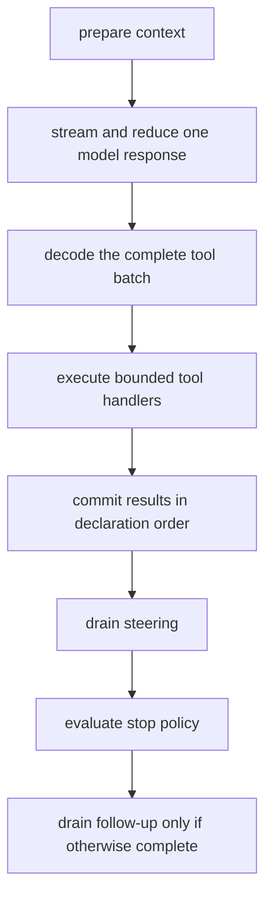

<a id="run-stream"></a>

The runtime exposes one scoped Effect execution through `run`, `stream`, and `start`. All three
decode input before instructions execute and require native model services. Use `runUnknown`, `streamUnknown`,
or `startUnknown` for external values typed as `unknown`. See
[Agent definitions](/guide/agents/#typed-and-external-inputs) and the authoritative
[runtime model](/concepts/runtime-model/).

Use `InMemory.layer` from `@yielded/agent` for in-memory conversations, including attached
subagents. Provide it once around the application and reuse a Thread ID for follow-up Runs.
It retains complete history updates and shares subagent reservation state for that Scope.
IDs are generated automatically, and context preparation is optional. Use
`PersistentHistory.layer` with a store to [retain completed runs](/guide/threads/#retain-completed-runs),
or a durable host when execution must recover after process loss.

A valid no-tool answer needs one model call. A designated completion Tool can complete without a
follow-up model call. Independent application Tools default to four concurrent handlers, behind
the batch's authorization and approval barrier. Use one when execution must be serial or a fixture
deliberately measures a sequential workflow. Continuity fixtures serialize changes to shared notes;
Code Mode examples bound generated programs separately. Node host worker concurrency is a separate
setting.

## Prompt caching

OpenAI and xAI Responses requests preserve system instructions in conversation order and place
the output contract after the initial system block. Changing instructions in later Runs and appended system context
stay after earlier history, preserving its cache prefix. An exact repeated instruction is omitted
only when no different system instruction intervenes. Conversation-only history can recover its
leading static instructions from those still present in the prepared prompt. Stored history remains intact.

The engine chooses this projection for the actual model selected on each call. The native
`LanguageModel` service's `supportsSystemMessagesInHistory` capability takes precedence over the provider
default. Without it, only `openai` and `xai` bindings use chronological instructions. Other adapters
group systems before the conversation, retaining the last equivalent instruction and its native
options. Changing that grouped block can invalidate the history cache.

The repository's Anthropic adapter requires grouping. Chronological Anthropic
history needs a release containing the [upstream adapter change](https://github.com/Effect-TS/effect/pull/8603)
and a model supporting
[mid-conversation system messages](https://platform.claude.com/docs/en/build-with-claude/mid-conversation-system-messages).
That adapter must retain system authority and place later instructions after the corresponding
user/tool results, before the next assistant response. A newer model name alone is insufficient.

For xAI, use the native `@effect/ai-openai` Responses adapter with an `OpenAiClient` whose
`apiUrl` is `https://api.x.ai/v1`. Where the host knows the Thread identity, bind the provider and
[routing key](https://docs.x.ai/developers/advanced-api-usage/prompt-caching/maximizing-cache-hits):

```ts
Model.make(
  "xai",
  "grok-4.3",
  OpenAiLanguageModel.layer({
    model: "grok-4.3",
    config: { store: false, prompt_cache_key: threadId },
  }),
);
```

Supply the configured `OpenAiClient` Layer to this Model, including when returning it from
`context.prepare` as `modelCall.model`. The routing key encourages server affinity; it does not
create a cache entry or guarantee a hit. This path uses Responses; xAI's Chat Completions header
`x-grok-conv-id` is a separate transport setting. Do not assume OpenAI-specific request options
such as `promptCacheBreakpoint` work on xAI.

For Anthropic, place native `options.anthropic.cacheControl` on the last retained user/tool message
before changing transient context, using context preparation. For example, use
`{ type: "ephemeral", ttl: "5m" }`. Request-level automatic caching can instead write after the
changing suffix; it alone does not establish reuse of the stable history. Follow Anthropic's
[cache placement and model limits](https://platform.claude.com/docs/en/build-with-claude/prompt-caching).
Keep trusted instructions in system messages and untrusted references in user/tool content.

The immutable output contract also retains its message identity across turns, allowing OpenAI's opt-in
native `ResponseIdTracker` reuse for ordinary append-only prompts. Context preparation, transient
references, and appended run status use full requests so provider-held responses cannot replay
discarded material. Full requests can still use provider prompt caching.

Keep tools and fixed instructions stable, and append changing context after history. Rewriting or
prepending context, compaction, and changing provider settings can invalidate cached prefixes.
Provider caching, minimum prompt lengths, and billing depend on the selected provider and
configuration; stable ordering does not guarantee a cache hit.

Context preparation is optional. Provide `RunContextPreparation` to load extra context;
without it, Runs use their normal prompt and compaction behavior. See
[context management](/guide/context-management/#recall-memory) for service-based recall and tagged errors.

## Await one result

```ts
const program = Effect.gen(function* () {
  const result = yield* AgentRuntime.run(agent, input);
  return result;
});
```

`run` closes run-owned resources before returning decoded output. A self-contained run needs no
caller `Effect.scoped`.

The result contains `output`, `threadId`, `runId`, `turns`, and `finishReason`.
Budget-limited results also include `exhausted`, naming `"turns"`, `"tool-calls"`, or `"tokens"`.

`runDisposition` appears only after ordinary completion when the definition declares one and its
selector returns a value. It contains schema-encoded JSON. Decode durable settlement values with
the same application schema.

With the default `onExhaustion: "final-answer"`, turn, tool call, or token exhaustion allows one
constrained final turn. The result reports `finishReason: "budget-exhausted"`, and `turns` may
exceed `maxTurns` by one. Duration or cost exhaustion, pending approval, interruption, and output
decoding failure remain failures. Set `onExhaustion: "fail"` to fail before the final turn.

## Observe semantic events

```ts
const events = AgentRuntime.stream(agent, input);

const program = events.pipe(
  Stream.tap((event) => Effect.log(event._tag)),
  Stream.runDrain,
);
```

Events cover run and turn lifecycle, text and reasoning deltas, tool activity, approval requests,
and one terminal classification. Provider SDK chunks do not enter this stable union.

For structured output, treat text deltas as provisional wire data. Show activity or received-character
progress until the terminal output passes its Schema; do not display partial JSON as an answer.
The demo follows this pattern. Plain-text output can render provisional text directly.
Provider parts are copied into bounded, engine-owned data and Schema-validated in order. The engine
publishes each part's semantic events before processing the next part, even within a single provider
chunk. A later invalid or interrupted part preserves earlier published progress and reported usage.
Transport fragmentation does not create an ownership span per delta.

Once stream consumption starts, a scoped producer advances until its bounded event buffer fills.
Slow consumption backpressures publication, but individual pulls do not pace tool execution.
The producer captures its execution Context at startup: provide services around the whole stream,
rather than changing them around individual pulls. Completion, failure, and interruption close its
resources. Interrupting the only ephemeral consumer interrupts the run.

Published `ToolProgress` results are owned JSON snapshots. Their cumulative UTF-8 JSON size is
limited to 8 MiB per run, shared by application and provider progress. This also bounds progress
payloads retained for detached replay and applies even when no progress is observed.
Oversized progress fails with `ModelProtocolError` without
truncation. Application progress must contain plain JSON data; accessors, custom serialization,
and non-finite numbers fail with the same error. Terminal tool results use `toolResultBounds`
separately.

Lower the progress allowance with `bufferLimits` on `run`, `stream`, or `start`. Larger values
cannot raise the engine's ceiling:

```ts twoslash
import { type RunBufferLimits } from "@yielded/agent/run-options";

export const progressBufferLimits: RunBufferLimits = {
  maxToolProgressBytes: 1024 * 1024,
};
```

`maxRunEvents` bounds progress produced by `stream` and `start`. Headless `run` and durable execution
do not produce a public event sequence. Use Agent policy limits to bound their execution; native
model-response and tool-result validation and bounds still apply.
`maxBufferedEvents` lowers the public stream queue capacity from its default of 1,024 events.

### Observe typed findings

Declare `updates` on an Agent to give it an `emit_update` tool for structured intermediate findings:

```ts twoslash title="observe-updates.ts" src="snippets/travel-planner/observe-updates.ts"

```

The [researcher definition](/guide/subagents/background/#send-intermediate-findings) declares the finding
Schema separately from its final output. `AgentUpdateEmitted` contains an accepted, encoded update;
`AgentUpdates.observe` decodes it through that Schema, including any required decoding services.
Emitting a finding lets the Agent continue working and does not complete the run.

Application tools can also emit findings with `AgentUpdates.emit`. See
[update delivery guarantees](/reference/subagents/#update-delivery-guarantees) for stable keys,
limits, and automatic delivery from a background worker to its parent.

### Connect a voice conversation

A voice adapter can delegate to the same agent and Thread as a text interface. Keep its media
Scope separate from accepted durable work: closing a call or stopping playback closes media and
observation, while the durable runtime retains its accepted-work obligation. Use the original
idempotency key and frozen input to reconcile uncertain admission. A transcript delta is context,
not an instruction to admit another Run. Corrections use ordinary queued input and steering.

The [travel planner](https://github.com/yielded-dev/agent/tree/main/examples/travel-planner) demonstrates GPT-Live client
delegation. Its adapter constructs schema-validated planner requests from attributed transcripts,
uses the existing planner admission path, and reconciles receipts against canonical settlement.
It tracks corrections by work identity rather than treating every caption as a new task. Spoken
and typed input share the demo conversation; attributed speech context is separate from the
user's work request and visible message. Typed results and later research answers return to the
active voice exchange. Reconnect restores relevant conversation history without restarting
accepted work. The demo retains undelegated speech in the current tab; it does not add a durable
partial-transcript journal.

For application-selected previews, decorate the native Effect AI `LanguageModel` service in the
model Layer. Its `streamText` exposes ordered `text-delta`, `tool-params-start`, and
`tool-params-delta` parts. The demo selects native text and only the designated
`deliver_response.message` field; it retains a bounded provisional preview and fences writes by
Submission and Attempt. Parsing and presentation belong to the adapter. Never forward reasoning,
arbitrary tool arguments, or diagnostics to a voice provider. Provider protocol interception is
unnecessary for this public-output path, and no additional SDK output hook is required.

Keep generation, schema validation, durable settlement, provider acknowledgment, and actual audio
playback distinct. A partial completion-tool argument is provisional even when it resembles a
complete sentence. A provider acknowledgment does not prove that the user heard the result.
Use canonical, schema-decoded output for final answers, including after reconnect. The
[official Live delegation guide](https://developers.openai.com/api/docs/guides/live-delegation)
describes the provider-specific half of this integration.

## Start and re-observe locally

```ts
const program = Effect.gen(function* () {
  const detached = yield* AgentRuntime.start(agent, input);
  const result = yield* detached.await;
  const completeTrace = yield* detached.events;
  return { result, completeTrace };
}).pipe(Effect.scoped);
```

`start` requires a caller Scope. `observe` replays prior events, follows new events, and ends when
the run settles. `events` returns the complete replay after settlement. Execution resources close
before `await` returns, while replay remains available until the owner closes.

Observers cannot backpressure execution. Closing the owner interrupts active work and observers.
The handle remains process-local and never creates a daemon fiber.

## Run durably on Cloudflare

Use a [Cloudflare thread object](/platforms/cloudflare/#create-the-thread-object)
to accept work that survives eviction. For a process with SQLite, use the
[Node host](/platforms/node/).

## Assemble a custom durable runtime

Platform hosts assemble storage and runtime services for you. When building your own host,
`DurableAgentRuntime.layer` supplies default prompt preparation and tool authorization.
Use `layerWithServices` to supply your own service layers. It requires
`RunToolAuthorization` and captures `RunContextPreparation` when provided.

Here is the default authorization policy; replace it with your application's implementation:

```ts twoslash
import { RunToolAuthorization } from "@yielded/agent/run-options";
import { DurableAgentRuntime } from "@yielded/agent/durable-agent-runtime";
import { Layer } from "effect";

export const RuntimeLive = DurableAgentRuntime.layerWithServices.pipe(
  Layer.provide(RunToolAuthorization.allowAll),
);
```

This layer still requires `SubmissionLedger`, `ThreadStore`, `RunStorage`, `WakeScheduler`,
`DurableRuntimeFailpoint`, `DurableRuntimeConfig`, `ToolReconciler`, and `Crypto.Crypto`.
Build `RunStorage.layer()` from the same adapter's `ThreadStore`, `SubmissionLedger`, and
`SettlementPublisher`. The publisher checks authority and appends the canonical settlement in
one storage transaction; there is no fallback for independently supplied stores. Provide these
services before acquiring the runtime.

The runtime captures its services at acquisition. Supplying a different layer around a later
worker call does not replace them. Acquire service dependencies in their layers and keep them
alive for the runtime's Scope. Durable service hooks must have no unresolved dependencies.
Preparation failures retain their `AgentInputError`, `MemoryRecallError`, or `CompactionError`
tags; `RunContextPreparationError` is their type union, not a wrapper. Durable execution records
failed Runs in Settlements with bounded, structured causal diagnostics and execution correlation;
it does not reconstitute the original error object from storage. Programmatic Worker inspection
and awaiting expose this evidence as `diagnostic`, while generated inspect tools and completion
reports omit it. Authorization returns an allowed or denied decision, or fails with
`AgentToolAuthorizationCheckError` when its check could not finish.
Configure [prompt preparation](/guide/context-management/#prompt-preparation-order)
and [tool authorization](/guide/tools/#authorize-tool-calls) in their respective services.

<a id="turn-boundaries"></a>

## Understand turn boundaries

Each turn follows this sequence:



`run` and `stream` use the same loop. Completion tools also drain steering after
their results commit: new input continues the active run at its next model turn.
When the completing run has exhausted its budget, follow-ups stay queued for a new run.
Durable runs drain the ready input prefix together, subject to the host ledger's
joining policy and the runtime batch bound. Each joined input retains its receipt;
only a later host response covers it. Inputs rejected by the prompt callback remain
queued for their own run without cancelling the host's model call. Recovery restores
all previously consumed, uncovered joins before the next call; the batch bound applies
to newly ready inputs.

Set `policy: { restartOnJoinedInput: true }` on an agent to let eligible joined input
replace a running model call. The first call starts immediately. The runtime cancels
only the disposable model stream, before any response commits or application tool
starts, and restarts with the combined input. It permits two replacements per run,
including across durable recovery; later joins use the ordinary seams. Calls exposing hosted
tools without `Tool.Readonly` keep seam steering because remote execution may precede streamed
evidence. Hosted web search and file search are read-only; they retain restart. Joining authority,
receipts, and settlement are unchanged.

Streaming clients must clear text and reasoning drafts for the `turnId` in a
`ModelRestarted` event. Its reason is `joined-input`; the replacement has a new turn ID.
Durable hosts retain the replacement count and any reported usage before the next call.
Cancelled `chat <model>` spans end interrupted with `effect_agent.model.outcome=aborted`
and `effect_agent.model.abort_reason=joined-input`. Unreported usage remains unknown.
Custom input adapters supply `RunInputHook.awaitJoin` to enable the same behavior;
durable adapters also implement `RunDurabilityHook.commitModelRestart`.

<a id="operational-hooks"></a>

## Add per-run hooks

`RunOptions` accepts per-run capability hooks. This process-local example uses in-memory history.
`history` provides an initial Prompt, and `onHistory` receives incremental updates.

```ts
const options: RunOptions<AppError, AppRequirements> = {
  threadId,
  history,
  input: toRunInputHook(commands),
  approval: toRunApprovalHook(approvalPolicy),
  budget: toRunBudgetHook(budget),
  context: toRunContextHook(contextTransform),
  scheduling: toRunSchedulingHook({ mode: "bounded", concurrency: 2 }),
  onHistory,
};
```

Hook errors join the run error channel, and their services join `R`. `onHistory` runs inline.
Writes completed before a later failure or interruption remain caller-owned. Persistent history
rejects competing history and input queue hooks before model or tool execution.

Pass [prompt preparation](/guide/context-management/#prompt-preparation-order) as `context` and
[tool authorization](/guide/tools/#authorize-tool-calls) as `toolAuthorization` when needed.
Ephemeral runs read these options; providing the durable service layers alone does not install
per-run hooks.

## Observe recovered tool failures

A tool may fail and the model may still complete the run. Install `toolFailureObserverLayer` from
`@yielded/agent` to report such failures.

This observer covers failures contained as results, including programmatic broker outcomes. It does
not duplicate model-declared failures that propagate through the run's Effect error channel, or
defects and interruptions. Native model-call argument rejections do not invoke it because no handler
started; their failed results and warning telemetry remain available.
Use [`ToolCallFailed.failureHandling` and tool telemetry](/guide/tools/#failure-remains-failure)
to distinguish returned failures from propagated ones, and handle the run's Effect exit separately.

```ts
import { toolFailureObserverLayer } from "@yielded/agent/run-options";
import { Effect, ErrorReporter } from "effect";

const failureReporting = toolFailureObserverLayer({
  observe: (observation) =>
    observation.cause === undefined ? Effect.void : ErrorReporter.report(observation.cause),
});

const program = AgentRuntime.run(agent, input).pipe(Effect.provide(failureReporting));
```

The engine does not forward observations to `ErrorReporter` by itself. Choose what to record and
redact. The observer runs inline at most once per in-memory Attempt. Replacement Attempts may
repeat an observation. Nothing here is serialized into thread history.

Observer defects cannot change the tool result, though a slow observer holds a tool permit. Avoid
calling the broker, running another agent, or interrupting the observer itself. Durable hosts
accept the same observer through their platform options. Call-local telemetry and any applicable
failure observer finish before the terminal Tool event is published, so stopping observation at
that event does not skip them.

<a id="interruption-is-ownership"></a>

## Scope run resources

A run Scope owns its model stream, tool fibers, and run-local resources. Closing it interrupts
children and runs finalizers. `run` completes cleanup before returning; `stream` closes its
resources when consumption completes, fails, or is interrupted. Services from an enclosing
application layer remain available to other runs until the application Scope closes.
Retrying a whole run can repeat external effects; use durable recovery when work must survive
interruption without automatically replaying uncertain ordinary tools.

Wrap several runs with one `Effect.provide(AppLive)` to reuse shared services. Keep caller scoping
for `start`, explicit resource acquisition, and any operation that requires `Scope`.

History retention waits for run-local cleanup, result validation, and commit before publishing
`RunCompleted`. Interrupting a waiter for durable accepted work only detaches that waiter. Abort a
durable Submission with an explicit persisted command. See
[Persistence & durability](/concepts/durability/).

## Trace agent and model calls

With an Effect tracer installed, filter `gen_ai.operation.name` to find agent work:

| Operation      | Span name                            | Identity                                              |
| -------------- | ------------------------------------ | ----------------------------------------------------- |
| `invoke_agent` | `invoke_agent <agent definition ID>` | Agent, Thread, Run                                    |
| `chat`         | `chat <configured model name>`       | Agent, Thread, Run, and Turn for ordinary model calls |
| `execute_tool` | `execute_tool <tool name>`           | Agent, Thread, Run, Turn, Tool Call                   |

All three carry `gen_ai.agent.name` (the definition ID), `gen_ai.agent.id` (the
Thread-backed instance), and `gen_ai.conversation.id` (the Thread ID). Existing
`agentId`, `threadId`, `runId`, and applicable `turnId` attributes remain available.
The `invoke_agent`, `chat`, and `execute_tool` spans retain their identity and outcome attributes.
Agent span names replace `AgentRuntime.run`; update filters using that old name.

Successful tool executions log at Debug; failures log at Warning. The default logger omits
successful tool logs. Tool spans retain their identity and outcome attributes at either log level.

Model calls label the existing Effect AI `LanguageModel.streamText` span rather than
creating a second model-call span. The configured model and provider are recorded as
`gen_ai.request.model` and `gen_ai.provider.name`; native providers retain their response
and token-usage annotations. Each retry and compaction summary has its own model span.
These labels add identifiers, not prompts, instructions, or tool payloads.

Library generators use `Effect.fnUntraced`; direct Effect-returning helpers need no wrapper.
Spans are reserved for agent run/turn, model and tool calls, browser and transport operations,
adapter storage operations, and recovery. The export check enforces their owning modules and
names across `Effect.fn`, Effect and Stream span primitives, and the storage span wrapper.
Helpers for stream parts, individual records, per-tool batch orchestration,
and decoded rows are always untraced; actual tool calls retain their `execute_tool` spans.
Use the enclosing operation spans for timing and failure diagnostics, and adjust filters that
relied on private-helper span names.

An agent span covers one active execution Scope. A durable Run resumed by another
Attempt can produce another span with the same Run ID; the span is not the entire
wall-clock lifetime of a suspended Run. See [Cloudflare tracing](/platforms/cloudflare/#agent-tracing)
for the dashboard setup and alarm-root behavior.

## Provider usage and cost evidence

`AgentRuntime` results and `RunCompleted` expose optional `usage` (own calls, including compaction) and
`delegatedUsage` (all attached descendants). Combine them once with `Usage.sumRunTotals`;
background workers are excluded. Child events repeat cumulative totals, so deduplicate by Run ID.

For failed or interrupted Runs, read `handle.usageReport` after `handle.await` settles or its
owning Scope closes. Earlier reads are live snapshots and may omit in-flight usage. Durable
settlements retain their richer per-model `usageSummary` for the Run's own calls.

A cost estimator receives the configured binding name in `request.model` and the actual
provider-reported identity in `request.response`. Use the latter for response-sensitive pricing.
`request.webSearchCalls` counts observed hosted web-search calls for adding the provider search fee;
Run totals and durable per-model summaries retain `webSearchCalls`. It excludes OpenAI page/find
actions and unobserved work, and legacy records may omit it.
`request.finishMetadata` carries native Effect AI finish metadata only during estimation; the
engine never persists provider HTTP details or raw metadata in accounting records. A summarizer
uses the same estimator with `purpose: "summary"`.

Calls and Run totals retain `usageStatus` and `pricingStatus`. Missing legacy status is unknown, and a numeric
zero without an estimate is not evidence of free execution. Run summaries distinguish complete,
partial, and unknown coverage; `unobservedModelCalls` counts observed calls without retained accounting,
which are excluded from numeric token and call totals. A canonical `ModelResponseInterrupted`
can indicate additional unquantified provider work beyond this count.

An explicitly configured `costBudgetMicrousd` fails with a typed cost-policy error when the
estimator reports unknown pricing, after retaining the call's usage. Uncapped Runs may continue;
legacy numeric estimates and estimates without a status remain trusted host estimates.

Response records also retain each Turn's missing-call count, so approval and child suspension
preserve incomplete accounting when a fresh runtime resumes the Run.

Headless runtime hosts use `AgentRuntime.executeWithUsageAccountingUnknown` with the inward
`ModelUsageAccounting` and `AgentUpdateAcceptance` services from `RunOptions`. These dependencies
remain visible in `R`. The native durable runtime supplies its canonical Turn accumulator and
Attempt-bound update acceptance at composition, retaining updates before acknowledging them.
Hosts that need public progress can use `streamWithUsageAccountingUnknown` with the same services.
Ordinary `stream`, `run`, and `start` calls provide ephemeral accounting and update acceptance.

Canonical response records own committed per-call usage. Terminal settlement
`uncommittedModelUsage` retains only staged calls not already present in a response record;
its charges are already included in `usageSummary`, so do not add them a second time. An isolate
loss before either response or settlement commit cannot prove the lost call's usage or cost.
