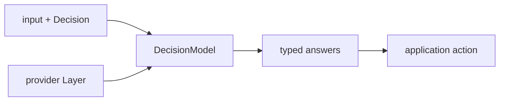

<a id="tools-layers"></a>

Define tools and toolkits with Effect AI. Yielded Agent runs their native handlers under its
scheduling, policy, and thread rules.

<a id="one-tool-system"></a>

## Define tools once

```ts
const Search = Tool.make("search", {
  parameters: SearchQuery,
  success: SearchResult,
  failure: SearchUnavailable,
  failureMode: "error",
  dependencies: [SearchIndex],
});

const Tools = Toolkit.make(Search);

const ToolsLive = Tools.toLayer({
  search: (query) => Effect.flatMap(SearchIndex, (_) => _.search(query)),
});
```

The tool declaration owns parameter, success, and failure schemas, approval, dependencies,
failure mode, and preliminary results. The runtime decodes every model-generated tool call through
that declaration.

Tool successes with a `Schema.Void` encoding, including the default, appear as JSON `null` in model
history and programmatic broker results. Handler return types stay unchanged. A custom encoding to
another JSON value takes precedence.

<a id="decision-transitions"></a>

## Compose decisions into state transitions

`Decision` from `effect/ai` defines typed assessments with an input Schema and named
decisions. A `DecisionModel` supplies the evaluator through a provider
Layer, such as Jev. Application code owns the next state, routing policy, and side effects.



| Query         | Use it to                                                      |
| ------------- | -------------------------------------------------------------- |
| `classify`    | Select a named option and inspect its probability distribution |
| `rate`        | Rate input along ordered levels, allowing fractional scores    |
| `probability` | Estimate whether a proposition is true, from 0 to 1            |

```ts twoslash
import { Decision, DecisionModel } from "effect/ai";
import { Effect, Schema } from "effect";

const TicketAssessment = Decision.make({
  input: Schema.Struct({ message: Schema.String }),
  decisions: {
    department: Decision.classify({
      instructions: "Which team should handle this ticket?",
      criteria: { billing: "Payments and refunds", technical: "Bugs and outages" },
    }),
  },
});

const assess = Effect.gen(function* () {
  const { answers } = yield* DecisionModel.decide(TicketAssessment, {
    input: { message: "Please refund my duplicate charge." },
  });
  return answers.department.label; // "billing" | "technical"
});
```

Provide `TypeSafeDecisionModel.model("jev-latest")` with its client Layer to run `assess`.
The [complete decision example](https://github.com/yielded-dev/agent/blob/main/packages/ai-decision/examples/decision.ts)
shows provider setup, all three queries, and an application state transition.

The input Schema encodes the data sent to the provider, so include only data it should receive.
Questions in one evaluation are independent; a question that depends on another answer needs
a subsequent evaluation. Probabilities inform application thresholds and do not grant permission
to act. Choose retry and timeout policies explicitly. See the
[reference](/reference/decision-models/) for options, evidence, and errors.

<a id="typesafe-evaluations"></a>

## Evaluate TypeSafe questions in a tool

A native Effect AI tool can run a fixed Jev assessment inside its handler. The language model
chooses when to call the tool; Jev answers the questions defined by the handler.

The [tool example](https://github.com/yielded-dev/agent/blob/main/packages/ai-decision/examples/tool.ts)
declares the input and result schemas, exposes `AiError` failures, and uses `Toolkit.toLayer`
to call the native `DecisionModel`. Supply `TicketToolsLive` with your other handlers and a
[configured decision model Layer](/reference/decision-models/#typesafe-client) when executing the tool.

<a id="progressive-discovery"></a>

## Discover tools progressively

A large registered catalogue can contain hundreds of tools even when a request needs only two.
`ToolDiscovery.make` adds an ordinary `discover_tools` tool. Start with common tools pinned, then
expose matching schemas after discovery. All tools retain their native Effect AI definitions and
handlers; omitting selection configuration and discovery preserves eager exposure.

```ts twoslash
import { Agent, ToolDiscovery, ToolExposure } from "@yielded/agent";
import { Effect, Layer, Schema } from "effect";
import { Tool, Toolkit } from "effect/ai";

const GetRecord = Tool.make("get_record", {
  description: "Read one record by its ID.",
  parameters: Schema.Struct({ id: Schema.String }),
  success: Schema.String,
})
  .annotate(ToolExposure.ToolNamespace, "records")
  .annotate(ToolExposure.PinnedTool, true);

const SearchRecords = Tool.make("search_records", {
  description: "Search records by title.",
  parameters: Schema.Struct({ title: Schema.String }),
  success: Schema.Array(Schema.String),
}).annotate(ToolExposure.ToolNamespace, "records");

const discovery = ToolDiscovery.make({
  maxResults: 8,
  maxResultBytes: 32_768,
  namespaceDescriptions: { records: "Record lookup and title search" },
});

export const agent = Agent.make("record-assistant", {
  input: Schema.String,
  output: Schema.String,
  instructions: "Use discover_tools to find missing tools. Return the answer as a JSON string.",
  toolkit: Toolkit.make(GetRecord, SearchRecords, discovery.tool),
  toolExposure: { initialToolNames: [], maxTools: 16, maxSchemaBytes: 65_536 },
});

export const Handlers = Layer.merge(
  Toolkit.make(GetRecord, SearchRecords).toLayer({
    get_record: ({ id }) => Effect.succeed(`Record ${id}`),
    search_records: ({ title }) => Effect.succeed([`Matching record: ${title}`]),
  }),
  discovery.handlers,
);
```

The first request exposes `get_record` and `discover_tools`. A call such as
`discover_tools({ query: "search", namespace: "records" })` returns metadata and encoded parameter
and success schemas; `search_records` becomes callable on the next turn. Provide handlers for the
full registered toolkit as before: hidden schemas do not remove requirements from `R`.

Default search matches every whitespace-separated query term, ignoring case, against names,
descriptions, methods and namespace hints, with deterministic catalogue-ID ordering. Namespaces
come from `ToolNamespace` annotations or Code Mode's allowlist, never from parsing a tool name.
Namespace hints appear only on eligible matches. Queries are bounded to 512 characters and exact
namespace filters to 128. The default considers at most eight matches and returns at most 32 KiB
of complete encoded JSON; limits can rise to 64 matches and 256 KiB. `maxResultBytes` measures
UTF-8 bytes of the whole discovery result, including metadata, schemas, `toolNames`, JSON escaping,
and any recovery `notice`. It is a host budget, not a provider requirement; size it against the
actual catalogue. The engine's tool-result and exposed-schema limits apply separately.

When the first `maxResults` candidates exceed that byte budget, discovery retains complete
matches in rank order whenever they fit, skipping larger matches and trying later candidates
within that count. It returns a successful result with a `notice` advising a narrower search or
namespace. Schemas are never cut, and omitted matches do not activate tools. If no match fits,
the result is `{ toolNames: [], matches: [], notice: "..." }`; the model can continue, but the
empty selection clears non-pinned tools. If a single tool still cannot fit, the notice advises
asking the host to increase `maxResultBytes`.

Byte overflow no longer emits `ToolDiscoveryError` with reason `limit-exceeded`. Invalid
catalogues, invalid selected schemas, and custom-search failures still propagate as errors.
Hosted matches include `providerName` and `requiresHandler`. Remote-only tools return `null`
for application parameter/result schemas; discovery still selects their native declarations.
Provider configuration stays with the host and is not returned in discovery documentation.

### Supply application search

The optional Effect callback receives only the eligible catalogue, already filtered by the exact
namespace. Return ranked `Descriptor.id` values. Every ID is validated before limiting results;
unknown or duplicate IDs fail closed. Native tools and each Code Mode alias have separate IDs.

```ts twoslash
import { ToolDiscovery } from "@yielded/agent";
import { Context, Effect, Schema } from "effect";

class SearchUnavailable extends Schema.TaggedError<SearchUnavailable>()("SearchUnavailable", {
  message: Schema.String,
}) {}

class SearchIndex extends Context.Service<
  SearchIndex,
  {
    readonly rank: (
      query: string,
      catalogue: ReadonlyArray<ToolDiscovery.Descriptor>,
    ) => Effect.Effect<ReadonlyArray<string>, SearchUnavailable>;
  }
>()("SearchIndex") {}

export const discovery = ToolDiscovery.make({
  failure: SearchUnavailable,
  search: (request, catalogue) =>
    Effect.flatMap(SearchIndex, (index) => index.rank(request.query, catalogue)),
});
```

Provide `SearchIndex` when building `discovery.handlers`. Its requirements remain in the Layer's
`R`, and declared failures remain in the tool's `E` alongside `ToolDiscoveryError`. Search runs in
a fresh Scope per invocation; failure, defect, timeout and interruption close acquired resources.

An existing ordinary readonly search tool can use the same contract: annotate it with
`ToolExposure.DiscoveryTool` and return a decoded `toolNames` array containing registered native
names. The runtime validates that selection before recording it. Discovery tools must use the
`ToolExecutionClass` annotation from `@yielded/agent/durable-step` with value `"readonly"`;
uncertain and orchestration tools have different durable settlement paths and are refused.

<a id="tool-selection"></a>

### Select without search

Host context and workflow state can use the same mechanism directly:

```ts twoslash
import { RunToolVisibility, Selection } from "@yielded/agent/tool-exposure";
import type { RunOptions } from "@yielded/agent/run-options";
import { Effect, Layer } from "effect";

export const options: RunOptions = {
  toolSelection: Selection.make({ toolNames: ["search_records"] }),
};

export const VisibilityLive = Layer.succeed(RunToolVisibility, {
  visible: ({ toolNames }) => Effect.succeed(toolNames.filter((name) => name !== "delete_record")),
});
```

Pass these options to `AgentRuntime.run`, `stream`, or `start`. A context preparation hook may
return `toolSelection` beside its `prompt` to replace the set before a new model request. Provide
`VisibilityLive` around an ephemeral run or when constructing a durable runtime. The optional
`RunToolVisibility` service defaults to no filter; durable hosts capture that choice, including
absence, so worker callers cannot replace it. Resolve policy dependencies and setup failures in
the host Layer, where their types remain visible. The policy operation returns eligible names;
an empty list denies all tools.

Visibility controls eligibility. Exposure controls which eligible native schemas the model sees.
Authorization, approval, budgets and resource checks still decide whether an action may execute.
Visibility and inherited grants are applied before custom search receives any names or docs.
Guessed native calls outside the original request exposure fail before handlers start. Code Mode
also filters its sandbox method surface and denies hidden inner calls; resource authorization
still belongs inside those handlers.

### Selection lifetime and recovery

Selections last for one run and **replace** the non-pinned set; they do not accumulate. An empty
successful selection clears it. If a batch contains several successful selections, the last in
declaration order wins, regardless of completion order. No selection takes effect midway through
a batch. Failed results retain the previous selection; ordinary tool error behavior still applies.

During working turns, eligible tools with explicit `PinnedTool` annotations stay exposed across
selections. Host visibility and inherited grants may hide these common tools without failing the
run. Discovery, required completion and context rollover tools are mandatory: excluding one causes
a typed refusal. Exposed pins count toward the limits and never override eligibility. Optional
completion is available in the final answer turn only when eligible; otherwise the model finishes
with text. That turn may expose only the completion tool. The default exposure limits are 64 tools and 256 KiB of aggregate
UTF-8 JSON declarations (names, descriptions and parameter schemas, including the current model's
schema transformation). Exceeding a limit fails with `ModelProtocolError`; there is no silent
eviction beyond replacement.

The runtime records the actual request exposure with each canonical model response and each
successful selection with its tool settlement, before result truncation. `ToolCallSucceeded`
also carries `toolSelection`. Durable recovery and compaction restore this canonical metadata
without searching again for a committed result. A crash before a result is committed follows the
ordinary readonly recovery contract. Resumed calls retain their original exposure and recheck
current eligibility before unfinished handlers run; already settled siblings remain canonical.
Custom durability hooks must persist `RunTurnResponse.toolExposure` with the response. Version
custom search semantics in your registration definitions as with other handler changes.

This provider-neutral API changes the native toolkit sent on subsequent calls. It does not use
provider-specific deferred-tool references or promise a latency win: extra discovery rounds and
provider prompt caching can outweigh smaller schemas. Measure common, uncommon and composed
tasks against eager exposure before claiming a performance improvement.

<a id="batch-execution"></a>

## Run batches deterministically

The runtime validates the complete model response before starting any handler. It resolves tool
names, validates parameters, checks budgets, and obtains approvals for executable calls in the whole batch.

It bounds both active call streams and handler execution by the resolved concurrency, using scoped
child fibers and a finite Effect `Semaphore`. Pending calls do not allocate waiting stream fibers.
Live progress follows actual completion order. Canonical history and the next model turn use
declaration order. The model never sees a partial batch.

<a id="failure-remains-failure"></a>

## Keep tool failures typed

The default `failureMode: "error"` keeps a declared tool failure in the Effect error channel and
fails the run. Declaring a `failure` Schema does not opt into recovery. Choose `failureMode: "return"`
when the model should receive the failure as a tool result and decide what to do next:

```ts twoslash
import { Agent } from "@yielded/agent";
import { Effect, Schema } from "effect";
import { Tool, Toolkit } from "effect/ai";

class SearchUnavailable extends Schema.TaggedError<SearchUnavailable>()("SearchUnavailable", {
  message: Schema.String,
}) {}

const Search = Tool.make("search", {
  parameters: Schema.Struct({ query: Schema.String }),
  success: Schema.Array(Schema.String),
  failure: SearchUnavailable,
  failureMode: "return",
});
const tools = Toolkit.make(Search);
const ToolsLive = tools.toLayer({
  search: () => Effect.fail(SearchUnavailable.make({ message: "Try another source." })),
});
const researcher = Agent.make("researcher", {
  input: Schema.String,
  output: Schema.String,
  instructions: "Search, then answer. Try another source if search is unavailable.",
  toolkit: tools,
});

Agent.inspectTools(researcher);
// [{ name: "search", failureMode: "return", requiresHandler: true }]
```

With `failureMode: "return"`, invalid JSON arguments for a native application tool also produce
a failed result containing Effect AI's `AiError` with reason `ToolParameterValidationError`. For
example, `query: Schema.NonEmptyString` rejects `{ query: "" }` and lets the model submit a corrected
query in the same run. The rejected call does not request approval, acquire execution authorization,
or invoke the handler. It still counts toward tool-call and failure budgets and emits
`ToolCallFailed` with `failureHandling: "returned-to-model"`, without `ToolCallStarted`.

The default `failureMode: "error"`, unknown tools, malformed non-JSON response data, and invalid
provider-executed parameters remain fatal. Valid transforming parameter codecs still supply decoded
values to handlers and encoded values to history.

Durable responses retain explicit rejection evidence tied to the original arguments. Recovery
returns that failure without executing the rejected call; other recorded parameters still undergo
strict validation and unfinished calls still require current authorization. Custom durability hooks
must persist `RunTurnResponse.toolParameterRejections` with the response and restore it through
`RunTurnResume.toolParameterRejections`. A failed result by itself cannot excuse corrupt parameters.

`Agent.inspectTools` accepts a Definition or Binding and reads its registered native toolkit without
starting a run or acquiring services. It includes tools outside the current exposure. Provider-executed
tools have `requiresHandler: false`; their results do not pass through a local handler's failure mode.

Inspect configuration and execution separately. A handler can catch its own errors, the programmatic
broker can contain an error-channel failure, and Subagent containment has its own policy. A returned
failure may still be followed by a run failure from a sibling, a repeated-failure limit, or another budget.

| Failure boundary                                                       | Behavior                                                                     |
| ---------------------------------------------------------------------- | ---------------------------------------------------------------------------- |
| Declared handler error, `"error"`                                      | Propagates the original typed error and fails the model-declared call's run. |
| Declared handler error, `"return"`                                     | Encodes a failed tool result for the model; the loop may continue.           |
| Handler defect or interruption                                         | Stays a defect or interruption under either mode.                            |
| Invalid result encoding                                                | Still fails even with `"return"`.                                            |
| Invalid native application parameters, `"return"`                      | Returns a failed result for the model without invoking that handler.         |
| Invalid parameters, `"error"`, or invalid provider-executed parameters | Fails the run before application handlers start.                             |
| Unknown or unexposed tool                                              | Fails the run before application handlers start.                             |

`ToolCallFailed.failureMode` reports the native configuration when known. Its `failureHandling` reports
the actual route: `propagated` or `returned-to-model`. Older events may omit these fields; absence means
unknown. `returned-to-model` records the result path; delivery still requires the complete batch to
commit and another model call. A failure event terminates that call, not necessarily the run. Use the
run's terminal event and Effect exit to determine the overall outcome.

Application tool spans and terminal logs carry `effect_agent.tool.failure_mode` and, on failure,
`effect_agent.tool.failure_handling`. Programmatic calls use `returned-to-caller` when the broker
returns a failure outcome, including a captured error-channel failure. A propagated defect is still
`propagated`. These attributes contain no error payloads. Interruption alone emits no terminal tool
failure log or failure-handling classification. Returned failures can also be reported through the
[recovered tool failure observer](/guide/run-agents/#observe-recovered-tool-failures).

Represent an expected empty result as success with `Option.none` or an empty collection.

<a id="scheduling-overrides"></a>

## Reduce concurrency per run

The agent policy sets the maximum concurrency. A run override can only reduce it.

```ts
const options = {
  scheduling: toRunSchedulingHook(
    { mode: "sequential" },
    (toolName) => toolName === "mutate_account",
  ),
};
```

Use sequential execution for mutating tools whose effects depend on order. Every other batch still
has a finite concurrency limit.

Durable hosts provide `RunToolScheduling` from `@yielded/agent/run-options` when constructing
the runtime. Its `toolRequiresSequential` predicate inserts barriers around those tools while
independent neighboring calls run concurrently. The runtime captures this host choice across
replacement attempts; a worker's ambient reference cannot replace it. Ephemeral runs use the same
reference unless `RunOptions.scheduling` is explicitly supplied.

<a id="approval"></a>

## Approve before execution

Effect AI's `needsApproval` marks a tool for approval. Yielded Agent turns its native
request into a typed Effect service with stable run identity, normalized resource targets, a
bounded preview, expiration, audit, and a deny or unresolved decision.

Approval occurs after parameter decoding and before any handler in the batch starts. The model
cannot approve a tool call. Durable batches retain every required request before honoring
decisions; a denial blocks the whole batch. Function-based predicates receive native readonly
Effect AI history, including opaque tool values; leave that history unchanged. Approval decisions
receive independent decoded arguments. Approval predicates accept non-JSON caller history,
including `undefined` and `Date` values.

## Authorize tool calls

Use `RunToolAuthorization` to decide whether a native or programmatic application tool call may execute.
Code Mode invokes the same policy for each inner call before reserving its budget or starting its
handler. The request includes `programmatic.parentToolCallId` and `programmatic.sequenceIndex`;
allowing the outer execution Tool does not grant permission to its inner Tools.
This policy permits only the `search` tool:

```ts twoslash
import { RunToolAuthorization } from "@yielded/agent/run-options";
import { Effect, Layer } from "effect";

export const searchOnly = RunToolAuthorization.of({
  authorize: ({ call }) =>
    Effect.succeed(
      call.toolName === "search"
        ? { _tag: "allowed" }
        : { _tag: "denied", reason: "Only search is permitted." },
    ),
});

export const SearchOnlyLive = Layer.succeed(RunToolAuthorization, searchOnly);
```

Provide `SearchOnlyLive` to `AgentRuntime.run`, `stream`, or `start`. A per-run
`toolAuthorization` option overrides the provided policy and retains its own typed failures
and service requirements. For durable execution, install `SearchOnlyLive` in the
[Node host](/platforms/node/#configure-runtime-services),
[Cloudflare application](/platforms/cloudflare/#configure-runtime-services), or
[custom runtime](/guide/run-agents/#assemble-a-custom-durable-runtime).

The policy receives run identity, encoded input, and the proposed call's name, ID, parameters,
and execution classification. Decode unknown input and parameters with the application's schemas
when checking resource access. Keep denial reasons safe to log.

The runtime checks each executable model-declared call after approval and before any handler in
the batch starts. A denial fails with `AgentToolAuthorizationDenied`. If that durable Submission
already has an abort intent, the runtime records the abort and settles it as aborted after joining
attached children. Other failures retain their original handling. Recovery checks calls that still
need execution; it reuses recorded results without executing or authorizing them again.

Return a denied decision only for an actual policy refusal. Its optional `cause` retains the
original policy evidence privately; keep `reason` safe for model context. If storage, transport,
or state validation prevents a check, fail with `AgentToolAuthorizationCheckError` from
`@yielded/agent/agent-error`, supplying the tool identity, a safe `message`, and the original Effect
`cause`. This distinct failure stops execution and is reported at the failed Run boundary.
Do not convert interruption or defects into a denial.

`FailureDiagnostic.Value` and `FailureDiagnostic.Cause` from `@yielded/agent/failure-diagnostic`
retain original local values and encode structured diagnostic data across private JSON boundaries.
The projection preserves tags, messages, reason/code, stacks, nested causes and Effect failure kinds;
it excludes arbitrary payload fields and redacts common credential forms. Diagnostics are private
operator data, never a ready-made user message. Keep private payloads out of error text; applications
can provide stricter text redaction to `FailureDiagnostic.capture`. Capture marks cycles and bounds
explicitly rather than pretending to reconstruct the original error after transport.
Use `FailureDiagnostic.captureContext` for bounded diagnostic correlation copies; shortened values
end in `[truncated]`, and the original identities remain in their owning records.
Worker admission and message-delivery failures retain the same causal data: `WorkerError.cause`
preserves live errors, and the delivery's `lastFailureDiagnostic` survives retries and recovery.
Retained worker inputs return `MessageStatus` with bounded delivery evidence, including pending
retry and definite refusal, without exposing these diagnostics to the model.
The delivery's receipt and refusal/retry classification remain the authority for safe retry decisions.
For tools using `failureMode: "return"`, project these errors into a separate safe failure schema.

Omitting both the service and per-run hook allows calls without this additional host check. Durable hosts use
`RunToolAuthorization.allowAll` by default. Install a policy before granting tools access to
protected resources. Authenticate callers and authorize runtime operations as described in
[operations](/guide/operations/#authorization-and-isolation).

This hook does not authorize provider-executed calls. A denied [Code Mode](/guide/code-mode/) inner call
returns a catchable `ProgrammaticToolAuthorizationDenied` outcome without consuming execution budget;
other independent calls may already have completed. The broker also restricts calls to the eligible
allowlist. Keep resource access checks inside handlers as appropriate for the application.

<a id="durability"></a>

## Handle uncertain external effects

Process loss ends an active tool call in an ephemeral run. Durable hosts commit the model response
and its normalized tool declarations before ordinary external effects. If the runtime cannot
determine whether the effect happened, it records an Unknown Outcome and waits for an explicit
resolution. It never replays the call automatically. See [Persistence & durability](/concepts/durability/).

Custom `RunDurabilityHook` implementations capture initial metadata in `initialize` and persist the
interpreter's `RunTurnCommit` facts through `commitTurn`. Handle `Response`, `Settled`, and `Partial`
commits directly; partial commits retain closed siblings before child suspension. Public events
and `onHistory` updates do not define durable commit boundaries. The required `checkpoint` Effect
must propagate retained infrastructure failures before further execution or commits, including
when no progress stream is observed.

<a id="mcp"></a>

## Connect MCP servers

`McpClient.layer` provides `McpConnector` over real transports. `McpClient.McpHttpTransport.make`
speaks Streamable HTTP and needs `HttpClient`; `McpClient.McpStdioTransport.make` runs a local server
process and needs `ChildProcessSpawner`, which `NodeServices.layer` supplies on Node.js. Both
requirements stay in the Layer's `R`.

```ts twoslash
import { Mcp, McpClient } from "@yielded/agent";
import { FetchHttpClient } from "effect/http";
import { Effect, Layer } from "effect";

const McpLive = McpClient.layer([
  McpClient.McpHttpTransport.make({ serverId: "docs", url: "https://mcp.example.com/mcp" }),
]).pipe(Layer.provide(FetchHttpClient.layer));

const program = Effect.gen(function* () {
  const connection = yield* Mcp.connectMcp(
    Mcp.McpConnectionRequest.make({
      serverId: "docs",
      maxToolCount: 16,
      maxToolDescriptionBytes: 1_024,
      maxDiscoveryBytes: 65_536,
      connectTimeoutMillis: 5_000,
    }),
  );
  // Merge `connection.toolkit` into the agent's toolkit and provide
  // `connection.handlers` with the application's other tool handlers.
  return connection;
});
```

`Mcp.connectMcp` negotiates a protocol revision, lists tools within the request bounds, and returns
dynamic Effect AI tools whose handlers forward `tools/call`. Provide the returned `handlers` Layer
wherever the agent runs. The connection lives in the caller's Scope; closing it ends the session
or stops the process. Server-initiated requests such as sampling and elicitation are declined, and
event streams are not resumed after a disconnect. A stdio `env` is added to the inherited
environment.

Remote tools stay ordinary tools: they are `uncertain` by default, need approval and authorization
like any other tool, and receive an Unknown Outcome after process loss. Set `trustToolAnnotations`
on a transport to let the server's `readOnlyHint` and `idempotentHint` choose the execution class.
A tool with `isError` fails the call with `McpToolCallFailed`. Set `expectedToolkitSchemaDigest`
on the request to reject a server whose tools changed since the agent was authored.

Remote servers are untrusted input. Bound their tool descriptions and results with the request
limits and `toolResultBounds`, supply credentials through the transport headers or `HttpClient`,
and keep local server commands under application control.

## Delegate to an agent

`Subagent.make` exposes a child agent as a tool with explicit input and result projections.
The [Subagents guide](/guide/subagents/) covers definitions, model requirements, budgets, authority, failure
handling, and durable child recovery.

<a id="web-search"></a>

## Search the web

Use `WebSearch.native` to let the agent's own model search and answer in the same call:

```ts twoslash
import { WebSearch } from "@yielded/agent";
import { OpenAiTool } from "@effect/ai-openai";

const SearchTools = WebSearch.native({
  tool: OpenAiTool.WebSearch({ search_context_size: "medium" }),
});
```

Use `SearchTools` as the agent's toolkit or merge it with application tools. Supply the agent's
normal model Layer; native search needs no handler or separate search model. The host fixes
provider options. Citations remain in native assistant text annotations and source events;
ask the model to include source URLs when projecting an answer through an application tool.
Search content and citation URLs remain untrusted.

Hosted calls and results are journaled with the model response and replayed without local
execution. Hosted configuration participates in replay contracts. `web_search`,
`web_search_preview`, and `file_search` are annotated `Tool.Readonly`, allowing joined input
to restart disposable calls; other hosted tools keep restart disabled unless the host explicitly
annotates them read-only. A lost or cancelled read request may run again and incur another charge.

`usage.webSearchCalls` counts observed hosted web searches alongside tokens, excluding OpenAI
page-open and in-page-find actions. The cost estimator receives the same per-call count as
`request.webSearchCalls`; add the provider's search fee there. Missing legacy counts or unobserved interrupted work do not establish zero cost.
With the pinned OpenAI adapter and `store: false`, subsequent calls omit hosted call/results
and retain URL citation annotations on assistant text. Full stateless reconstruction of hosted
search items is an upstream Effect gap.

For a separately selected search model, keep the existing nested mode. `WebSearch.tool` is an
ordinary application tool with `{ query }` input and a `text`, `sources`, and token `usage`
result. Its handler uses a separately supplied LanguageModel. Include `WebSearch.tool` in the
agent's toolkit, then provide this handler Layer:

```ts twoslash
import { WebSearch } from "@yielded/agent";
import * as Gateway from "@yielded/agent-platform-cloudflare/cloudflare-ai-gateway";
import { OpenAiClient, OpenAiLanguageModel, OpenAiTool } from "@effect/ai-openai";
import { Layer, Redacted } from "effect";
import { FetchHttpClient } from "effect/http";

const gateway = {
  accountId: "your-account",
  gatewayId: "your-gateway",
  apiToken: Redacted.make("your-cloudflare-token"),
};

const SearchLive = WebSearch.layer({
  tool: OpenAiTool.WebSearch({ search_context_size: "medium" }),
  timeoutMillis: 30_000,
  maxOutputBytes: 32 * 1024,
}).pipe(
  Layer.provide(
    OpenAiLanguageModel.model("openai/gpt-6-luna", {
      max_output_tokens: 2_048,
      store: false,
    }),
  ),
  Gateway.provide(OpenAiClient.layer, { ...gateway, protocol: "responses" }),
  Layer.provide(FetchHttpClient.layer),
);
```

Load real gateway credentials from your host configuration or secret store. For Anthropic,
select `AnthropicTool.WebSearch_20250305({ maxUses: 3 })`, provide an `AnthropicLanguageModel`
Layer, and use `Gateway.provide(AnthropicClient.layer, { ...gateway, provider: "anthropic" })`.
Direct provider clients work too. See the [Cloudflare guide](/platforms/cloudflare/#ai-gateway)
for gateway configuration.

Each invocation makes one model request, without handler retries. The host fixes the backend,
native search options, deadline (1–300,000 ms), and encoded result limit (1–1,048,576 bytes).
Queries are bounded to 8,192 characters and results to 64 source citations. A missing completed
search, provider error, invalid result, or exceeded limit returns `WebSearchFailure`. Defects
and interruption propagate; timeout interrupts the in-flight request. Search results and source
URLs remain untrusted, and a citation grants no permission to fetch it. No provider payload or
credential is included in the tool result. Model-call telemetry remains upstream Effect AI's;
the wrapper adds the `WebSearch.search` span without logging queries or responses itself.

Search is separately billed. Returned token counts use `null` when unavailable and are **not**
added to the parent Run's model usage or spending limit. Configure provider output limits and
host billing controls. Both modes work with [Gateway client configuration](/platforms/cloudflare/#ai-gateway).
The ordinary WebSearch tool remains uncertain for recovery: an unresolved call is not replayed
automatically after ownership loss.

## Browse web pages

Use `WebCapture.make`, `WebCapture.makeScrape`, or `WebCapture.makeExtract` to expose authorized page
capture as Effect AI Tools. The [browser guide](/guide/browser/) shows how to supply capture and crawl
adapters, take screenshots, and open scoped interactive passes, including Live View and handoff.

### Capture and crawl

Choose a Worker binding or a Node-safe REST adapter in [capture and crawl](/guide/browser/#capture-and-crawl).
Structured extraction requires explicit Workers AI authorization and accounting.

### Interact with a browser

The [interactive browser walkthrough](/guide/browser/#interact-with-a-browser) covers Layer setup,
network policies, bounded actions, and session cleanup.

## Execute code

[Code Mode](/guide/code-mode/) lets an agent write bounded JavaScript that calls an allowlisted set of
read-only Tools through an isolated executor. [Sandbox execution](/guide/sandbox/) covers structured
process requests and the trusted local adapter.
