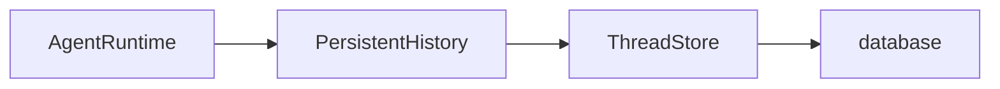

Storage adapters provide Effect services for thread history and accepted work.
Choose where that state lives, then connect the stores to your agent runtime.

| Backend                            | Use                                                                   |
| ---------------------------------- | --------------------------------------------------------------------- |
| [In-memory](/storage/memory/)      | Conversations within one application Scope; isolated stores for tests |
| [SQLite](/storage/sqlite/)         | Persistent history in a local Node.js database                        |
| [PostgreSQL](/storage/postgres/)   | A database shared by multiple processes, using your Effect SQL client |
| [Cloudflare](/storage/cloudflare/) | SQLite owned by a Durable Object                                      |

Keep `@yielded/agent` and its adapters on the same release. See
[installation and compatibility](/guide/getting-started/#installation-and-compatibility)
for the matching Effect and model provider packages.

## Connect storage to execution

Use `InMemory.layer` for conversations that live with your application.
For history that survives a restart, connect a database's `ThreadStore` to
`PersistentHistory.layer` and provide it to `AgentRuntime`:

The [SQLite](/storage/sqlite/) and [PostgreSQL](/storage/postgres/) guides show the complete Layer wiring.
Successful Runs are retained; interrupted execution is not resumed. Reuse a thread ID
to continue its conversation. See [Threads](/guide/threads/) for history behavior.

Durable execution also needs a `SubmissionLedger`, a `SettlementPublisher`, registered agents,
and a host that drives recovery and pending work. The publisher belongs to the same storage owner
as the journal and ledger: it checks settlement authority and appends the canonical terminal fact
atomically. `RunStorage.layer()` requires this adapter service; independently supplied stores do
not provide a non-atomic fallback. The [Node.js](/platforms/node/) and
[Cloudflare](/platforms/cloudflare/) hosts assemble those pieces with their storage.
For another host, see [custom durable runtime composition](/guide/run-agents/#assemble-a-custom-durable-runtime).
Storage alone does not start workers or recover unfinished Runs.

## Back up or change record formats

A Thread keeps one canonical order and producer fence throughout its lifetime. Storage rotates
complete batches into bounded ranges; archiving a range preserves exact record identities and
digest anchors. Compaction changes the model view, independently of physical storage. SQL
adapters verify archive contents and publish their locator before removing hot payload copies.

`streamExport({ threadId })` acquires `ThreadExportSource` and yields snapshot-bound pages of
canonical batches, immutable admissions, accepted commands, and retained deliveries. Pass those pages to the local `ThreadImport`
service through `reencodeThread(source)`, or save the NDJSON archive with the admin CLI. Import
validates every page and referenced fact, applies destination admission constraints, and publishes
atomically into an empty Thread. Missing dependencies leave the destination unchanged. Historical
closed workers and children remain evidence; unsupported live foreign obligations refuse transfer.
Claims, leases, checkpoints, and recovery caches are not transferred. Unresolved effects retain
their uncertainty.

Provide `ThreadExportSource.layer()` from the source `ThreadStore`, or SQLite's read-only
`exportSourceLayer({ filename })`. Bind that source separately from the destination import Layer
when transferring between stores.

The unreleased protocol accepts only fresh layout-21 stores and `effect-agent/thread@3` records.
Predecessor stores fail before mutation; no older layout upgrade or archive converter is included.
See the [operator procedure and limits](/guide/operations/#adopting-these-contracts).

## Build another adapter

`@yielded/agent-storage-sql` contains shared SQL implementations for thread history,
submissions, schedules, subscriptions, message delivery, and activity progress.
SQLite and PostgreSQL use this core; Cloudflare reuses the helpers that fit Durable Objects.

An adapter supplies the database-specific initialization, transactions, and error handling
around an Effect `SqlClient`. Start with the [shared SQL package reference](/reference/packages/#effect-agent-storage-sql)
and [storage adapter contracts](/guide/certify-adapters/).
