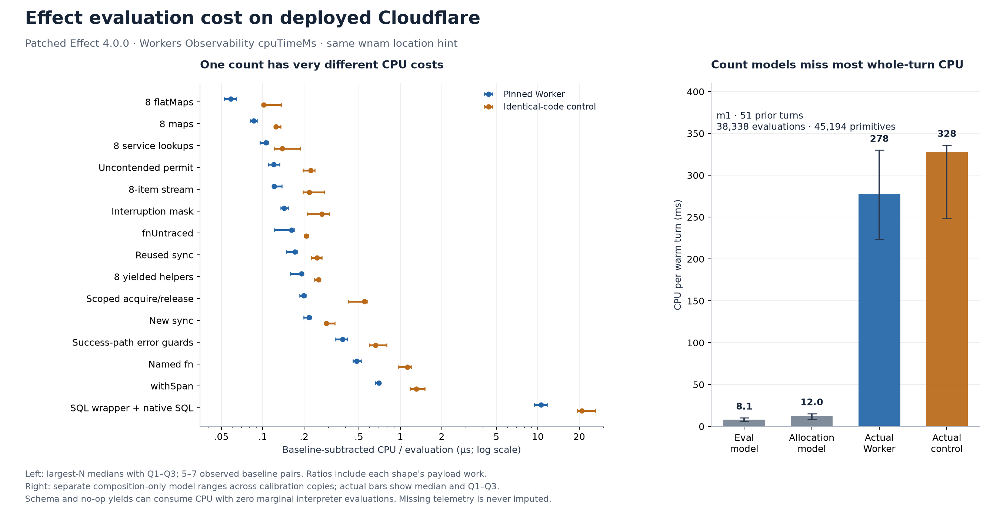

**Effect evaluation cost on deployed Cloudflare — 8 October 2026**

There is no useful universal CPU price for an Effect evaluation. On the patched, pinned Effect 4.0.0 deployment, the measured composition shapes range from **59 to 701 ns per evaluation** after subtracting an empty loop; removing fixed setup with a two-size slope gives **55 to 690 ns**. A SQL-wrapping evaluation costs 10.5 µs including its SQL work. Identical-code Workers differ substantially, and zero-evaluation paths still consume CPU. Primitive allocation counts predict slightly better than evaluation counts in this experiment, but neither predicts held-out shapes or a real turn well enough to steer CPU optimization alone.

The old **15,149-evaluation remainder is now mapped**. Current `origin/main` at `8c05714de84d68961b14e5ab7a3b7d809599563f` still performs **37,431 evaluations and 44,024 counted primitive constructions** at the first measured position with 50 historical turns. Only **30 evaluations (0.08%) and 111 constructions (0.25%)** lack a dynamic call site. The largest newly named site is race orchestration, followed by checkpoint/deadline/turn handling and tool dispatch. Across the whole turn, schema construction origins account for more allocations than the engine module.

Extrapolating KOM-433's actual first-position reduction of 2,695 evaluations / 3,032 constructions gives only **0.42–1.02 ms** under the separate count models. Those models are illustrative, not validated savings estimates. Actual deployed later-warm turn CPU is **235.5 ms [196.5–297.8]**, with an identical-code control at **313.5 ms [169.8–331.0]**. The old Node experiment's control spread could not establish a small effect; Cloudflare calibration cannot supply a Node unit price.

**All 13 Worker names created by this task were destroyed and verified absent through the Cloudflare API; no owned Durable Object namespaces remained in the completed cleanup checks.** Private Alchemy state/auth was removed after verification. [Cleanup evidence](cleanup.json). A later supplemental namespace-ID recheck could not run with the currently available credentials because their account hash differs; an initial unguarded check was invalidated. The original account-guarded cleanup receipts remain the evidence. [Recheck limitation](cleanup-supplemental-status.json). No product code changed. The full `vp run ready` gate passed; [validation receipt](validation.json).

The calibration table below uses the largest planned batch for each shape. CPU and ratios are medians [Q1–Q3] of available observations, not confidence intervals. E and A are marginal interpreter steps and primitive constructor calls relative to the zero-iteration case. `ns/E` and `ns/A` divide **the same** empty-loop-subtracted CPU; they must never be added. “Extra” is the paired Effect-versus-plain difference, which is the more relevant quantity when considering a synchronous conversion. Full counts, both batch sizes, all three Effect builds, both controls, paired ratios, client wall time and DO wall time are in the [complete calibration tables](calibration/per-build-tables.md) and [raw summary](calibration/summary.json.gz).

| Shape | Iterations | E/iteration | A/iteration | Pin CPU ms [Q1–Q3] | Plain CPU ms | ns/eval | ns/primitive allocation | Extra ns/iteration over plain |
|---|---:|---:|---:|---:|---:|---:|---:|---:|
| sync | 262144 | 1.0 | 1.0 | 57.0 [52.0–59.5] | 1.0 [1.0–1.0] | 217.1 [198.1–226.6] | 217.3 [198.3–226.9] | 213.6 [194.5–223.2] |
| sync-reused | 262144 | 1.0 | 0.0 | 45.0 [39.5–46.5] | 1.0 [1.0–1.0] | 171.4 [148.6–177.1] | 351562.5 [304687.5–363281.3] | 167.8 [148.8–173.6] |
| gen8 | 262144 | 11.0 | 11.0 | 551.0 [458.0–560.5] | 1.0 [1.0–2.5] | 190.8 [158.6–194.1] | 191.0 [158.8–194.3] | 2098.1 [1739.5–2132.4] |
| map8 | 262144 | 9.3 | 9.2 | 208.0 [199.5–220.5] | 1.0 [1.0–1.0] | 85.8 [81.0–90.9] | 85.9 [81.2–91.1] | 789.6 [755.3–837.3] |
| flatMap8 | 262144 | 17.0 | 17.0 | 261.5 [234.3–286.5] | 2.0 [1.3–2.0] | 58.6 [52.5–64.2] | 58.7 [52.5–64.3] | 991.8 [886.0–1089.1] |
| errors-success | 262144 | 3.0 | 3.0 | 299.0 [269.5–326.0] | 1.0 [1.0–1.0] | 379.6 [338.4–413.9] | 380.0 [338.7–414.3] | 1136.8 [1024.2–1239.8] |
| fn-untraced | 262144 | 4.0 | 4.0 | 170.0 [130.0–177.0] | 1.0 [1.0–1.0] | 161.9 [120.9–168.6] | 162.0 [121.1–168.7] | 640.9 [492.1–671.4] |
| fn-traced | 65536 | 12.0 | 12.0 | 380.0 [358.0–411.0] | 0.0 [0.0–0.0] | 482.5 [452.7–519.9] | 483.0 [453.1–520.5] | 5798.3 [5462.6–6271.4] |
| service8 | 262144 | 19.0 | 11.0 | 526.0 [478.0–550.5] | 2.0 [1.5–2.5] | 105.5 [95.8–110.4] | 182.3 [165.6–190.7] | 1998.9 [1817.7–2090.5] |
| stream8 | 65536 | 28.0 | 22.0 | 222.0 [215.8–253.8] | 7.0 [6.5–8.0] | 120.8 [117.4–138.1] | 153.9 [149.5–175.9] | 3288.3 [3173.8–3757.5] |
| schema-decode | 262144 | 0.0 | 4.0 | 488.0 [465.0–506.0] | 369.0 [363.0–379.0] | — | 465.4 [443.5–482.6] | 354.8 [335.7–478.7] |
| schema-encode | 262144 | 0.0 | 4.0 | 441.0 [424.0–501.0] | 415.0 [390.0–428.5] | — | 420.6 [404.4–477.8] | 259.4 [-17.2–347.1] |
| sql | 16384 | 1.0 | 1.0 | 173.0 [154.0–191.5] | 166.0 [145.5–177.5] | 10543.6 [9385.7–11671.1] | 10553.9 [9394.8–11682.5] | 1464.8 [-701.9–2258.3] |
| scope | 65536 | 16.1 | 16.0 | 209.0 [195.8–219.3] | 0.0 [0.0–0.0] | 198.4 [185.8–206.7] | 199.2 [186.6–207.6] | 3189.1 [2986.9–3345.5] |
| semaphore | 262144 | 6.0 | 6.0 | 189.0 [173.0–209.0] | 1.0 [1.0–1.0] | 120.0 [109.8–132.7] | 120.1 [109.9–132.8] | 717.2 [656.1–791.5] |
| interrupt-mask | 262144 | 2.0 | 2.0 | 77.0 [73.0–80.5] | 1.0 [1.0–1.0] | 142.8 [135.2–153.3] | 143.0 [135.4–153.5] | 289.9 [274.7–303.3] |
| span | 65536 | 9.0 | 10.0 | 414.0 [388.5–422.3] | 0.0 [0.0–0.0] | 700.9 [657.7–712.3] | 631.4 [592.5–641.7] | 6317.1 [5928.0–6443.0] |
| failpoint | 262144 | 0.0 | 0.0 | 27.0 [25.5–29.5] | 1.0 [1.0–1.0] | — | — | 99.2 [93.5–108.7] |
| allocate | 4194304 | 0.0 | 1.0 | 87.5 [82.0–92.3] | 82.0 [78.5–89.0] | — | 19.6 [18.2–20.2] | -0.8 [-1.0–0.5] |

The reused-sync case has almost no new primitives; its enormous `ns/A` ratio is mostly interpreter work divided by occasional scheduler constructions, not an allocation price. Schema's successful parser returns can be consumed directly by the generator: these cases do real work and allocate four primitives per iteration while adding **zero run-loop evaluations**. A cached `Effect.void` failpoint similarly adds zero E/A but costs about 99 ns per call versus the plain loop. The allocate-only case retains objects in a ring to make allocation observable: about 19.6 ns per counted construction including amortized work, with no interpreters involved. Its difference from plain object allocation is unresolved. SQL's extra cost also spans zero at Q1; 10.5 µs/E is primarily SQL plus its wrapper, not a dispatcher cost.

The PR comparison uses [Effect #8914](https://github.com/Effect-TS/effect/pull/8914), head `01c6222ccf74390848595633ef23410cbfa6983b`, against **its merge-base** `757821fe99b7179f907d6d1a34a4e86de4173112`. Pinned 4.0.0 is an additional calibration, not the PR baseline. Selected paired largest-batch ratios illustrate why the control matters:

| Shape | Head / merge-base [Q1–Q3] | Identical base-control / base [Q1–Q3] | Matched rounds | Interpretation |
|---|---:|---:|---:|---|
| Eight yielded helpers | 0.692 [0.677–0.804] | 0.753 [0.682–0.785] | 7 | Within control envelope |
| Eight flatMaps | 0.663 [0.634–0.737] | 0.708 [0.604–0.820] | 7 | Within control envelope |
| Named fn | 0.508 [0.491–0.582] | 0.669 [0.661–0.697] | 5 | Incomplete pairs |
| Schema decode | 0.568 [0.527–0.611] | 0.681 [0.656–0.754] | 7 | Beyond descriptive envelope; all seven pairs |
| Race: synchronous winner first | 0.451 [0.395–0.454] | 0.710 [0.608–0.809] | 6 | Incomplete pairs |
| Race: loser armed first | 0.208 [0.159–0.303] | 0.940 [0.797–1.000] | 6 | Incomplete pairs; large observed signal |

At the largest planned N, only Schema decode crosses the descriptive control-envelope rule with all seven matched pairs in the main calibration. It is an exploratory shape-specific signal, not evidence of a universal PR speedup. The armed-loser race is a strong partial-sample signal, but missing telemetry leaves six pairs, so it does not satisfy the primary completeness rule. Base and head have **identical logical E/A counts** for that race despite the large observed CPU difference. No difference smaller than its identical-code envelope is claimed. Multiple shape comparisons, deployment variation and the partial pairs limit stronger inference. The [race supplement](calibration-race/per-build-tables.md) includes both orderings, plain checksums and [loser-finalization proof](calibration-race/proof.json).

The current stage map preserves the exact eight KOM-433 boundaries. Their exclusive evaluation counts have not changed for this fixture; admission allocates two fewer primitives. The “outside” row is a coarse stage remainder, now partitioned into named sites, not an unassigned-site bucket. These **conditional arithmetic projections fail validation**: they use separate 156–266 ns/E and 193–338 ns/A composition-only slope fits from the two pinned copies. They are not measured stage CPU, upper bounds, or removable budgets.

| Exclusive stage | Evaluations | Allocations | E-only model ms | A-only model ms |
|---|---:|---:|---:|---:|
| outside-eight-stages | 15,149 | 16,619 | 2.36–4.03 | 3.21–5.62 |
| context-assembly | 9,976 | 12,412 | 1.55–2.65 | 2.40–4.20 |
| durable-object-append | 6,179 | 6,348 | 0.96–1.64 | 1.23–2.15 |
| continuation-preparation | 2,062 | 3,424 | 0.32–0.55 | 0.66–1.16 |
| tool-settlement-commit | 1,040 | 1,116 | 0.16–0.28 | 0.22–0.38 |
| model-response-commit | 926 | 1,950 | 0.14–0.25 | 0.38–0.66 |
| settlement | 869 | 937 | 0.14–0.23 | 0.18–0.32 |
| admission | 693 | 717 | 0.11–0.18 | 0.14–0.24 |
| ownership-acquisition | 537 | 501 | 0.08–0.14 | 0.10–0.17 |
| **Whole turn** | **37,431** | **44,024** | **5.82–9.95** | **8.50–14.88** |

The largest dynamic sites inside the former remainder are below. The ranges apply the same unvalidated E-only model for comparison; [full projections](projection-tables.md) also give the A-only model, all stages and top 25 sites/modules. Dynamic exclusive attribution assigns each event to the nearest active selected function. It is not a sampling profiler.

| Site outside the original eight stages | E | A | Conditional E-only ms |
|---|---:|---:|---:|
| `internal/effect.raceAllFirst:3` — 56 entries | 2,325 | 1,431 | 0.36–0.62 |
| `DurableAgentRuntime.runModel.checkpoint` — 101 entries | 1,111 | 505 | 0.17–0.30 |
| `agent-runtime.beforeExecutionDeadline` | 888 | 288 | 0.14–0.24 |
| `agent-runtime.execution.turns` | 883 | 334 | 0.14–0.23 |
| `DoSubmissionLedger.claimJoining` | 810 | 300 | 0.13–0.22 |
| `agent-runtime.executeToolBatch` — 8 batches | 609 | 353 | 0.09–0.16 |
| `RunContinuation.progress.check` | 606 | 505 | 0.09–0.16 |
| `DurableAgentRuntime.durability.initialize` | 594 | 191 | 0.09–0.16 |
| `agent-runtime.ownModelResponsePart` | 403 | 83 | 0.06–0.11 |
| `agent-runtime.toolBatchContinuation` | 392 | 128 | 0.06–0.10 |
| `agent-runtime.executePreparedToolCall` | 328 | 224 | 0.05–0.09 |
| `agent-runtime.processModelPart` | 160 | 77 | 0.02–0.04 |

Across the whole turn, dynamic `SqlThreadNativeReads.readPrompt` is largest at **7,615 E / 1,165 A** (1.18–2.02 ms in that model). The construction-origin view explains where reused primitives were made before their evaluation. These are **alternative partitions**, not additional work to add to the stage or dynamic tables:

| Construction-origin module | E | A | Conditional E-only ms | Conditional A-only ms |
|---|---:|---:|---:|---:|
| Effect `SchemaAST` | 6,826 | 15,054 | 1.06–1.82 | 2.91–5.09 |
| `agent-runtime.ts` | 3,906 | 3,898 | 0.61–1.04 | 0.75–1.32 |
| Effect `internal/effect` | 3,196 | 2,966 | 0.50–0.85 | 0.57–1.00 |
| `DurableAgentRuntime.ts` | 2,414 | 2,016 | 0.38–0.64 | 0.39–0.68 |
| `RunJournal.ts` | 2,346 | 2,368 | 0.36–0.62 | 0.46–0.80 |
| `RunContinuation.ts` | 1,920 | 1,776 | 0.30–0.51 | 0.34–0.60 |
| `do-journal.ts` | 1,883 | 1,765 | 0.29–0.50 | 0.34–0.60 |
| `DoSubmissionLedger.ts` | 1,734 | 1,673 | 0.27–0.46 | 0.32–0.57 |
| `SqlThreadNativeReads.ts` | 1,661 | 1,626 | 0.26–0.44 | 0.31–0.55 |
| Effect `Semaphore` | 1,254 | 1,239 | 0.20–0.33 | 0.24–0.42 |
| Effect `SchemaParser` | 1,030 | 1,915 | 0.16–0.27 | 0.37–0.65 |
| Effect `SchemaGetter` | 625 | 966 | 0.10–0.17 | 0.19–0.33 |

SchemaAST alone is 18.2% of E and 34.2% of A. These schema totals cover canonical storage, context, tools and model handling; they are not all response decoding. Effect `ai/LanguageModel` originates only 167 E / 151 A, and `ai/Response` 0 E / 6 A; their synchronous callbacks and schema work can execute outside those origins. Named codec boundaries include 403 `decodeUnknownEffect` and 39 `encodeUnknownEffect` entries, but the boundary calls themselves need not dispatch. This is why replacing all schema work with “number of evaluations” loses information.

Permit acquisition has 312 selected callback entries. Span termination has 280 entries and originates 280 E/A, while most span work is ordinary JS or other primitives. There are 135 disabled failpoint calls with 0 E/A, plus storage failpoint wrappers originating 60 E/A. The turn has 4,030 `OnFailure` dispatches, 613 `OnExit`, and 189 `Async`; **these are opcodes, not counts of removable handlers, Scopes, SQL calls or external waits**. In particular, 88 SQL `Statement` dispatches must not be presented as 88 native `SqlStorage.exec` calls.

All exclusive partitions close exactly, repeated raw counter rows match, and every individual unknown-origin/dynamic bucket stays below 5% at all ten positions. At m0 the largest unknown origin is `Service`, 665 E (1.78%). A known constructor with no business caller, `Success`, accounts for 1,259 E (3.36%); this remains explicit rather than being disguised as a named engine site. Across all 14 origin rows without a business caller, the total is 2,661 E (7.11%) / 111 A; the dynamic unassigned total is still only 30 E. [Counter semantics, selectors and verification](attribution/README.md); [complete attribution](attribution/summary.json.gz).

The fallback whole-turn comparison deployed only Yielded's existing durable-bench with a telemetry wrapper, because no completed sibling result was available when needed. Every object has 50 scripted historical turns, a fresh runtime after an environment-only redeploy, recovery in a separate RPC, then m0–m9 with nine model calls and eight readonly tool calls each. m0 has exactly 50 prior turns but fresh model caches; m1–m9 reuse that runtime and have 51–59 prior turns. They are reported separately.

| Position / aggregation | Pin CPU ms [Q1–Q3] | Identical-control CPU ms [Q1–Q3] | Count-model prediction |
|---|---:|---:|---|
| m0, exactly 50 prior turns, recovery excluded | 510.0 [422.0–672.3], n=6 | 650.0 [348.0–681.5], n=7 | E: 5.82–9.95 ms; A: 8.50–14.88 ms |
| m1, 51 prior turns, runtime reused | 278.0 [223.8–330.0], n=6 | 328.0 [248.5–336.0], n=7 | E: 5.96–10.19 ms; A: 8.73–15.27 ms |
| Median of object medians over available m1–m9 observations | 235.5 [196.5–297.8], 6 objects | 313.5 [169.8–331.0], 7 objects | 7–9 observed positions per object; history changes |

At m0 the paired identical-control / pin ratio is **1.080 [0.871–1.659]** over six pairs. Client wall time is **891.0 [668.5–991.3] ms** versus **944.8 [677.3–1051.7] ms**; Observability DO wall time is **767.0 [626.5–855.8] ms** versus **894.0 [620.5–986.0] ms**. The inside-DO `Date.now()` difference is **zero throughout the measured turns**, despite nonzero CPU and client/telemetry wall time. It is retained as evidence of the frozen in-isolate clock, never interpreted as zero latency. Every position's CPU and wall data is in [the raw summary](real-turn/summary.json) and [turn-by-turn projections](projection-tables.md).

Both historical (`b017b487524e44a4`) and post-measurement (`b73859cee894aca6`) transcript fingerprints match the deterministic fixture for every included cohort. All 14 seed snapshots and 13 completed final snapshots match the local uninstrumented canonical table counts, including **235 batches / 603 records** after seed and **355 batches / 943 records** after the ten turns. [Table-count comparison](real-turn/canonical-table-check.json). The fingerprint normalizes the last model-visible request; it is not a hash of the entire canonical archive. Product fencing, history hashes, accounting and recovery code were unchanged, and no unresolved call was replayed.

The count models explain only a small fraction of this observed CPU. This does not identify the residual as any single subsystem: synchronous parsing, JS object work, copying/hashing, native SQL, tracing, compilation and GC are not separately timed here. Nor is comparison to the supplied Miniflare numbers a production regression measurement. Instrumented counting and uninstrumented hosted builds, deployment variation, history position and warmup differ. Both whole-turn builders resolve workspace package source and patched Effect dist; they are not optimization-identical bundles. Scaling every stage up to force the sum to 510 ms would manufacture attribution, so this report does not do that.

The following ranking is a set of **conditional conversion scenarios**, ordered by modeled magnitude. None is a measured prototype saving; they overlap and cannot be added. It helps choose a small deployed experiment, not justify wholesale removal of semantics.

| Rank | Hypothetical work removed | Modeled ms per first turn | Code-shape cost / constraint |
|---|---|---:|---|
| 1 | All 4,030 `OnFailure` frames priced as the microcase's two success-path guards | 1.76–3.43 | Only internal operations proven synchronous/infallible could lose redundant guards. Preserve typed `E`, schema failures, asynchronous errors and public Effect boundaries. The removable fraction is unknown. |
| 2 | 280 span entries priced as no-exporter `withSpan` | 1.68–2.91 | Loses tracing detail and named-function diagnostic context. Real span kinds vary; the 280 endings are not 280 identical wrappers. |
| 3 | KOM-433's demonstrated usage/projection/continuation conversions | 0.42–1.02 | Pure internal functions can retain typed Effect wrappers at the boundary; flattening removes cooperative interruption opportunities within the region. Preserve accounting and recomputable continuation facts. |
| 4 | 312 uncontended permit wrappers | 0.17–0.33 | Retain bounded concurrency, interruption and release on all exits. A synchronous leaf may avoid nested acquisition only when the existing owner already holds the permit. |
| 5 | 56 simple race orchestration entries | 0.04–0.16 | Real races include deadlines, asynchronous winners and cleanup absent from the microcases. Keep cancellation and joined loser cleanup. This is not the CPU of the 2,325-E dynamic race bucket. |
| 6 | 135 no-op failpoints plus 60 storage wrappers | 0.026–0.032 | Removes fault-injection boundaries used to prove recovery behavior for only tens of microseconds. Low priority. |
| — | Genuine Scope/resource lifetime or interruption checkpoints | Not established | A scoped acquire/release microcase costs roughly 3.19 µs over its plain `try/finally`, and a mask about 0.29 µs. No valid turn-level Scope/checkpoint entry count or removable fraction was measured. `OnExit` is not a Scope count. Resource cleanup, fencing and cancellation remain required. |

KOM-433's exact first-position reduction was 37,431 → 34,736 E and 44,026 → 40,994 A; context accounted for 2,001 of the 2,695 removed evaluations. The old ten-position median ratio was about 0.917 E / 0.925 A, hence the rounded “8% / 3k” description. Pricing exactly 3,000 E with the composition fits gives 0.47–0.80 ms. The preserved historical Node experiment reports prototype / baseline **1.007 [0.997–1.096]** and identical-control / baseline **1.005 [0.929–1.174]** across seven triplets. A 24.4-percentage-point control IQR cannot establish a small reduction. That experiment used fresh threads and four tools, not this 50-history/eight-tool fixture; no new Node or Miniflare timing was run. [Original report](kom433-source/report.md).

The practical metric should be **paired deployed invocation CPU for an identical fixture**, with a separate identical-code control and enough samples to resolve the proposed change. Keep E/A/opcode counts to explain composition changes and detect work growth. Pair them with stage-specific work quantities such as records/bytes decoded, native SQL calls/rows and wrapper/span/permit entries when investigating those paths; do not substitute a global E or A scalar for CPU. Allocation counts here mean selected Effect constructors, not total heap allocations or bytes; V8 may also eliminate some constructed objects. Prefer a focused context/schema experiment first because its affected work is large and the old prototype already demonstrated a semantics-preserving count reduction; do not infer its CPU saving from the ranking.

**Method and limits.** The workload choices followed the actual source: `agent-runtime.ts` and `RunContinuation.ts` use small yielded helpers, service access, error wrappers, bounded tool dispatch and deadline races; `RunJournal.ts` and prompt reads consume streams; `SqlThreadWork.ts`, `DoThreadStore.ts` and `do-journal.ts` repeatedly encode/decode Schemas and guard adapter failures. The SQL microcase executes `SELECT ? AS n` and consumes the cursor in both paths. It prices a wrapper around a real native call, not a storage transaction. Plain versions preserve the success-path payload/checksum; they intentionally do not promise Effect's error, concurrency or interruption semantics. All are valid-input, scripted workloads without provider network traffic.

Each shape runs a fixed 1× or 4× iteration count in one deployed DO invocation. Seven alternating rounds reverse both Worker order and Effect/plain order. There are five Workers per micro experiment: pinned, identical pinned control, merge-base, head, identical merge-base control. The race supplement uses its own builds and controls; do not compare their absolute medians as if they shared deployment conditions. The main pinned control's matched ratios span roughly 1.09–2.57 across shapes; the race control often runs around 0.45× the pinned copy. Identical bytes and the same `wnam` hint did not produce an invariant execution rate. The cause is not identified. Cloudflare describes the location hint as best effort, not a same-machine guarantee. [DO location documentation](https://developers.cloudflare.com/durable-objects/reference/data-location/).

CPU comes exclusively from Workers Observability's `cpuTimeMs` on a uniquely joined DO RPC invocation. Empty loops use the exact same N; large-batch ratios remove the matching baseline, and two-N slopes additionally remove fixed setup. Some auxiliary exact-N baseline requests were collected at the end of the main schedule, so drift remains a limitation. No in-isolate timer is used to price synchronous work. Client and DO timestamps are secondary waiting diagnostics; HTTP ingress CPU and separate alarm/recovery invocations are not silently charged to the measured RPC. [Cloudflare CPU/wall definitions and limits](https://developers.cloudflare.com/workers/platform/limits/).

Counts use the KOM-433 primitive constructors and interpreter hook in a separately instrumented bundle. Head #8914 introduces specialized constructors and a `ContImpl` shortcut, so its counter observes the equivalent **logical run-loop step before that shortcut**, with inline successes separate. No counter runs in the uploaded timing bundles. The attribution harness wraps selected source function bodies with fiber-local scopes and tracks construction origins without editing product files. It handles abandoned generators and verifies zero unclosed scopes. Nested async ancestry is not inferred from an ambient wall-time interval. Full semantics and known origin gaps are in [the attribution README](attribution/README.md).

GC was observed, not assumed: each of the ten micro Workers registered 4,096 unreachable sentinels, then ran three batches of 4,194,304 retained-ring constructions. All 4,096 finalizers were observed by the probe after the first pressure batch on every Worker, with unchanged incarnation/instance. [Main GC receipts](calibration/hosted/gc.json), [race GC receipts](calibration-race/hosted/gc.json). This establishes collection under the allocation workload, not a precise GC pause duration or a GC charge per invocation. The callbacks' execution points and CPU attribution are unknown; they need not run between requests or at a guaranteed time. No forced collection or heap-byte measurement was used. [Cloudflare FinalizationRegistry support](https://developers.cloudflare.com/changelog/post/2025-05-08-finalization-registry/), [callback lifecycle documentation](https://developers.cloudflare.com/workers/configuration/compatibility-flags/#enable-finalizationregistry-and-weakref).

For the model comparison, nonnegative fits use per-iteration shape medians, so merely increasing N cannot manufacture correlation. All roles use the same eligible shape set, with at least five complete subtraction tuples per shape; the slope composition fit has 14 shapes. On the pinned Worker, leave-one-shape-out R² is **0.001 for evaluations** and **0.087 for allocations**; on its control it is **−0.092 / 0.005**. Including SQL and codecs makes held-out prediction worse. The joint fit selects the allocation-only boundary and cannot establish two independent prices; E/A predictors are strongly collinear (cosine about 0.982). The small race set is too collinear to fit. Allocation is marginally less bad on these shape mixtures, but the whole-turn failure is decisive for either proxy.

A ratio is reported only for its exact available round pairs. The descriptive control envelope is the maximum of the identical-code ratio's Q1/Q3 distances from 1 and its IQR width. A primary positive flag also requires all seven candidate/control pairs. This is deliberately a descriptive resolution rule, not a significance test or multiplicity-adjusted claim. Missing observations are never zeros and low-N data never silently substitute for missing planned high-N observations.

Telemetry is incomplete even with invocation logs and `headSamplingRate: 1`. Queries stayed below the 2,000-event result cap; retained metadata reports `abrLevel: 1` and sample intervals of 1 where available. Repeated polling and a narrow known-trace query did not recover all missing DO invocation events. A sample requires a unique structured-log or ingress anchor, a consistent trace, one DO RPC, matching script version/object/build/fixture/input/checksum, a finite CPU value and `outcome: ok`. Conflicting anchors and all duplicate invocation claims are rejected. [Telemetry query API](https://developers.cloudflare.com/api/resources/workers/subresources/observability/subresources/telemetry/methods/query/).

| Lane | Planned measured requests | HTTP successes | Valid joined CPU | Missing/failure treatment |
|---|---:|---:|---:|---|
| Main microcases | 2,940 | 2,939 | 2,817 | One transport failure and 122 missing unique DO joins retained; an additional 15 subtraction tuples lack a baseline. |
| Race supplement | 560 | 560 | 538 | 22 missing CPU joins; eight additional missing subtraction baselines. |
| Real turns | 140 | 134 of 135 attempted | 127 raw; 123 included | One transport failure, five later turns deliberately unattempted, seven missing CPU joins in completed cohorts; four valid CPUs in the partial cohort excluded from comparisons. |

The failed real-turn invocation was never replayed. Only untouched cohorts resumed; 13 of 14 objects completed both fingerprint checks. There were no observed `exceededCpu` or `exceededMemory` outcomes, but missing invocations' outcomes remain unknown. Raw real-turn telemetry includes **146 canceled alarm invocations with zero reported CPU** and 139 successful alarms consuming 2,264 ms in aggregate across seeding and measurement. They are retained and separate from turn-RPC CPU; the aggregate cannot be allocated reliably to individual turns. The failed startup and readiness/pilot errors are retained too.

All deployments used task-prefixed Alchemy stacks, `bundle: false`, invocation logging at sampling rate 1, CPU limit 300,000 ms, compatibility date `2026-08-18`, and `wnam` for every compared DO. Uploaded modules were checked against built bytes through the API. The root catalog's Effect patch SHA-256 is `0051517e101fedd1c2822d1b9787accbc7025afab1624ac97bf5ba41d54a3229`. Temporary upstream clones used the exact head and merge-base, with the same patch's source hunk applied to both. Pin uses published patched dist; upstream variants use the same esbuild 0.28.1 source-to-dist pipeline. The head/base comparison shares that compiler, but comparing either with published pin also changes build provenance. This is not an upstream semantic/type-check run.

| Experiment / Effect identity | Uncompressed bundle bytes | SHA-256 |
|---|---:|---|
| Main / patched 4.0.0 and identical control | 858,056 | `92f1568cd985f1a03a6b3185897ac017b75935a10e4bb9879c7b54a73524c937` |
| Main / merge-base and identical control | 1,346,089 | `9a5e2e5e6f085ed4b7a5985c2fcb465df40f299893a599903e398357bd597fd4` |
| Main / PR head | 1,359,042 | `0a204768801b32e16b0055b7bb9da48ec691d73d1bdb63378713522a7cdb16a4` |
| Race / patched 4.0.0 and identical control | 667,555 | `5ec2a38a9200ac6c06ad128ccf54fbc55e0000d31745869ada1aade00edfc794` |
| Race / merge-base and identical control | 1,314,460 | `db479a6928dc4a27a1706f397a7c53a1d90bfb4214f1af8aedac38a20f08b611` |
| Race / PR head | 1,327,413 | `77b0c536b91243dfc8cbf4b2eb4dd57a578f8239b958978ea0d567347806523a` |
| Real turn / patched 4.0.0 and identical control | 3,433,709 | `9c2369ccc95ea0a5e6031f74b49a4c962d9921feff537e86fe35a74c02010d7e` |

The fixture SHA-256 values are main `5d6c0fb8e747d34ffb62d0b274f58e767e60a99d97db7789a7237709ec05599f`, race `cecfbc7abb9216e08403c0dd0c274dba3bbb1096559ca9ecacb3832f3527466c`, and real turn `8a0017cd405df8afcd90afa88944b670090e54db3f87da71ace68a60ea7a591f`. Per-Worker versions, source/input inventories, runtime file hashes, receipts and frozen bundle bytes are retained alongside each lane. [Replay instructions and artifact index](README.md). The captured source revision is the fetched `origin/main` at experiment start, not a moving claim about later commits.
